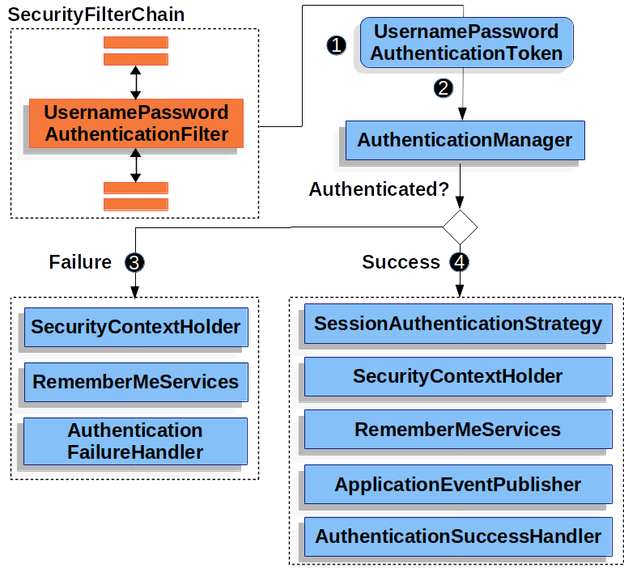

# 什么是Spring security

Spring Security是一个提供身份验证、授权和针对常见攻击的保护的框架。

# Spring security 的Maven依赖包

## 基于Spring Boot的项目
- Spring Boot提供了一个spring-boot-starter-security依赖包，该包集合了Spring Security相关的所有依赖。在Spring Boot项目中只需引入对spring-boot-starter-security的依赖就可以使用Spring Security提供的所有功能。
- Spring Boot提供了一个 Maven BOM 来管理依赖版本，所以我们不需要特别指定版本。但是如果需要覆盖 Spring Security 版本，可以通过提供 Maven 属性spring-security.version来实现。

```
<properties>
	<!-- ... -->
	<spring-security.version>6.1.0</spring-security.version>
</properties>
<dependencies>
	<!-- ... other dependency elements ... -->
	<dependency>
		<groupId>org.springframework.boot</groupId>
		<artifactId>spring-boot-starter-security</artifactId>
	</dependency>
</dependencies>
```

## 非Spring Boot的Spring项目
- 在不使用 Spring Boot 的情况下使用 Spring Security 时，首选方法是使用 Spring Security 的 BOM，以确保在整个项目中使用一致的 Spring Security 版本
```
<dependencyManagement>
	<dependencies>
		<!-- ... other dependency elements ... -->
		<dependency>
			<groupId>org.springframework.security</groupId>
			<artifactId>spring-security-bom</artifactId>
			<version>{spring-security-version}</version>
			<type>pom</type>
			<scope>import</scope>
		</dependency>
	</dependencies>
</dependencyManagement>
```

- spring-security-bom包含的spring security相关的包


- 一个最小的 Spring Security Maven 依赖集通常至少包括spring-security-web和spring-security-config
```
<dependencies>
	<!-- ... other dependency elements ... -->
	<dependency>
		<groupId>org.springframework.security</groupId>
		<artifactId>spring-security-web</artifactId>
	</dependency>
	<dependency>
		<groupId>org.springframework.security</groupId>
		<artifactId>spring-security-config</artifactId>
	</dependency>
</dependencies>
```

- Spring Security 针对 Spring Framework 6.0.9 构建，但通常应与任何较新版本的 Spring Framework 5.x 一起使用。但是在实际使用过程中可能出现由于Spring Security 的传递依赖项而导致的依赖冲突，可能会导致奇怪的类路径问题。解决此问题的最简单方法是在 pom.xml 的 <dependencyManagement> 部分中使用 spring-framework-bom指定spring-framework的版本为6.0.9。
```
<dependencyManagement>
	<dependencies>
		<!-- ... other dependency elements ... -->
		<dependency>
			<groupId>org.springframework</groupId>
			<artifactId>spring-framework-bom</artifactId>
			<version>6.0.9</version>
			<type>pom</type>
			<scope>import</scope>
		</dependency>
	</dependencies>
</dependencyManagement>
```

# Spring Security的特性
## 身份验证
- Spring Security 为身份验证提供了全面的支持。
- 身份验证是我们验证谁试图访问特定资源的身份的方式。
- 验证用户身份的常用方法是要求用户输入用户名和密码。一旦执行身份验证，我们就知道身份并可以执行授权。
- Spring Security 为验证用户提供内置支持。
### 密码存储
- Spring Security的PasswordEncoder接口用于对密码进行单向转换，让密码安全存储。
- 通常，PasswordEncoder 用于存储需要在身份验证时与用户提供的密码进行比较的密码。
### DelegatingPasswordEncoder
- 密码以{id}encodedPassword的方式存储
```
{bcrypt}$2a$10$dXJ3SW6G7P50lGmMkkmwe.20cQQubK3.HZWzG3YB1tlRy.fqvM/BG 
{noop}password 
{pbkdf2}5d923b44a6d129f3ddf3e3c8d29412723dcbde72445e8ef6bf3b508fbf17fa4ed4d6b99ca763d8dc 
{scrypt}$e0801$8bWJaSu2IKSn9Z9kM+TPXfOc/9bdYSrN1oD9qfVThWEwdRTnO7re7Ei+fUZRJ68k9lTyuTeUp4of4g24hHnazw==$OAOec05+bXxvuu/1qZ6NUR+xQYvYv7BeL1QxwRpY5Pc=  
{sha256}97cde38028ad898ebc02e690819fa220e88c62e0699403e94fff291cfffaf8410849f27605abcbc0 
```
- 支持多种PasswordEncoder同时使用
- 可以使用PasswordEncoderFactories创建默认的DelegatingPasswordEncoder
```
PasswordEncoder passwordEncoder =
    PasswordEncoderFactories.createDelegatingPasswordEncoder();
```
- 通过查看PasswordEncoderFactories的源码，我们可以看到默认的DelegatingPasswordEncoder支持10种PasswordEncoder
```
public class PasswordEncoderFactories {
	public static PasswordEncoder createDelegatingPasswordEncoder() {
		String encodingId = "bcrypt";
		Map<String, PasswordEncoder> encoders = new HashMap<>();
		encoders.put(encodingId, new BCryptPasswordEncoder());
		encoders.put("ldap", new org.springframework.security.crypto.password.LdapShaPasswordEncoder());
		encoders.put("MD4", new org.springframework.security.crypto.password.Md4PasswordEncoder());
		encoders.put("MD5", new org.springframework.security.crypto.password.MessageDigestPasswordEncoder("MD5"));
		encoders.put("noop", org.springframework.security.crypto.password.NoOpPasswordEncoder.getInstance());
		encoders.put("pbkdf2", new Pbkdf2PasswordEncoder());
		encoders.put("scrypt", new SCryptPasswordEncoder());
		encoders.put("SHA-1", new org.springframework.security.crypto.password.MessageDigestPasswordEncoder("SHA-1"));
		encoders.put("SHA-256", new org.springframework.security.crypto.password.MessageDigestPasswordEncoder("SHA-256"));
		encoders.put("sha256", new org.springframework.security.crypto.password.StandardPasswordEncoder());

		return new DelegatingPasswordEncoder(encodingId, encoders);
	}

	private PasswordEncoderFactories() {}
}
```
- 可以自定义DelegatingPasswordEncoder，只提供自己需要的几种PasswordEncoder
```
String idForEncode = "bcrypt";
Map encoders = new HashMap<>();
encoders.put(idForEncode, new BCryptPasswordEncoder());
encoders.put("pbkdf2", Pbkdf2PasswordEncoder.defaultsForSpringSecurity_v5_5());
encoders.put("sha256", new StandardPasswordEncoder());

PasswordEncoder passwordEncoder =
    new DelegatingPasswordEncoder(idForEncode, encoders);
```

### Password Encoding
- 传递给构造函数的 idForEncode 决定了使用哪个 PasswordEncoder 来对新创建的密码进行编码。
- 在我们之前构造的DelegatingPasswordEncoder中，就是说将密码编码的工作委托给BCryptPasswordEncoder，并以{bcrypt}为前缀保存编码后的密码到数据库。最终结果类似于以下示例：{bcrypt}$2a$10$dXJ3SW6G7P50lGmMkkmwe.20cQQubK3.HZWzG3YB1tlRy.fqvM/BG

### Password Matching
- 密码匹配验证时使用的PasswordEncoder是由存储的编码后的密码中的{id}来决定的
- 如果当前的DelegatingPasswordEncoder的encoders中不包含{id}指定的PasswordEncoder，则使用DelegatingPasswordEncoder.defaultPasswordEncoderForMatches来对密码进行匹配
- defaultPasswordEncoderForMatches默认为UnmappedIdPasswordEncoder，encode方法会抛出UnsupportedOperationException， matches方法会抛出IllegalArgumentException，There is no PasswordEncoder mapped for the {id}
- 可以调用DelegatingPasswordEncoder.setDefaultPasswordEncoderForMatches来设置defaultPasswordEncoderForMatches

### Password Storage Configuration
- Spring Security默认使用DelegatingPasswordEncoder来对密码进行编码和匹配
- 我们可以自定义一个PasswordEncoder的bean来对密码进行编码和匹配

### Change Password Configuration
- 可以通过HttpSecurity来对更新密码的url进行配置
- HttpSecurity对更新密码页面默认配置的url为/change-password，当 password manager访问/.well-known/change-password时，Spring Security会重定向到/change-password页面
```
http
    .passwordManagement(Customizer.withDefaults())
```

- 可以通过changePasswordPage的配置来制定更新密码页面的url，以下配置中当 password manager访问/.well-known/change-password时，Spring Security会重定向到/update-password页面
```
http
    .passwordManagement((management) -> management
        .changePasswordPage("/update-password")
    )
```

## 防止漏洞利用
- Spring Security 提供针对常见攻击的保护。默认情况下都会启用保护。

### Cross Site Request Forgery (CSRF)
#### 什么是CSRF攻击
- 假设您的银行网站提供了一个表单，允许将资金从当前登录的用户转移到另一个银行账户
```
<form method="post"
	action="/transfer">
<input type="text"
	name="amount"/>
<input type="text"
	name="routingNumber"/>
<input type="text"
	name="account"/>
<input type="submit"
	value="Transfer"/>
</form>
```
- 表单提交时，发送的请求如下
```
POST /transfer HTTP/1.1
Host: bank.example.com
Cookie: JSESSIONID=randomid
Content-Type: application/x-www-form-urlencoded

amount=100.00&routingNumber=1234&account=9876
```
- 现在假设你在你的银行网站上进行了身份验证，然后在没有注销的情况下访问了一个恶意网站。恶意网站包含一个具有以下形式的 HTML 页面：
```
<form method="post"
	action="https://bank.example.com/transfer">
<input type="hidden"
	name="amount"
	value="100.00"/>
<input type="hidden"
	name="routingNumber"
	value="evilsRoutingNumber"/>
<input type="hidden"
	name="account"
	value="evilsAccountNumber"/>
<input type="submit"
	value="Win Money!"/>
</form>
```
- 当你点击提交按钮的时候，浏览器就会给银行转账的url发送请求，发送请求时会带上银行网站的Cookie，有了这个Cookie，就可以通过银行网站的身份验证，进而成功向恶意用户的账户进行转账。

#### CSRF攻击发生的前提
- 用户在浏览器上进行了身份验证（比如登录操作），且该身份验证产生的Cookie仍在有效期内
- 银行网站的Cookie没有设置SameSite Attribute，导致在任意网页向银行网站发送请求都可以携带银行网站的Cookie
- 银行网站没有验证发送请求的网站是否为银行自己的网站

#### 如何避免CSRF攻击
##### CSRF Token
- 防止 CSRF 攻击的主要且最全面的方法是使用 Synchronizer Token Pattern。
- 这个解决方案是为了确保每个 HTTP 请求除了我们的会话 cookie 之外，还需要一个称为 CSRF Token的安全随机生成值出现在 HTTP 请求中
- 提交 HTTP 请求时，服务器必须查找预期的 CSRF Token并将其与 HTTP 请求中的实际 CSRF Token进行比较。如果值不匹配，则应拒绝 HTTP 请求
- 这项工作的关键是实际的 CSRF Token在浏览器发送请求时不会自动包含在HTTP 请求中。例如，在 HTTP 参数或 HTTP Header中传递实际的 CSRF Token可以防止 CSRF 攻击，但如果将CSRF Token保存在Cookie中，则 CSRF Token将不起作用，因为即便在恶意网站给银行网站发送请求，浏览器也会自动将银行网站的Cookie 包含在 HTTP 请求中。
- 引入CSRF Token之后，银行网站的页面将添加一个_csrf的隐藏input来保存回银行网站服务器返回的CSRF Token， 并在发送请求时自动将该_csrf参数包含在内。恶意站点无法读取 CSRF Token，因为同源策略可确保恶意站点无法读取银行网站服务器返回的响应，自然也就无法获取到响应中包含的CSRF Token。
```
<form method="post"
	action="/transfer">
<input type="hidden"
	name="_csrf"
	value="4bfd1575-3ad1-4d21-96c7-4ef2d9f86721"/>
<input type="text"
	name="amount"/>
<input type="text"
	name="routingNumber"/>
<input type="hidden"
	name="account"/>
<input type="submit"
	value="Transfer"/>
</form>
```
- 表单提交时，发送的请求如下, 请求的request parameter中将包含一个_csrf的参数，银行网站可以验证请求中 CSRF Token与服务器保存的 CSRF Token是否一致。恶意网站将无法为 _csrf 参数提供正确的值，当服务器将请求中的 CSRF Token与服务器保存的 CSRF Token进行比较时，验证将失败。
```
POST /transfer HTTP/1.1
Host: bank.example.com
Cookie: JSESSIONID=randomid
Content-Type: application/x-www-form-urlencoded

amount=100.00&routingNumber=1234&account=9876&_csrf=4bfd1575-3ad1-4d21-96c7-4ef2d9f86721
```

##### Cookie的SameSite Attribute
- 一种防止 CSRF 攻击的新兴方法是在 cookie 上指定 SameSite 属性
- 服务器可以在设置 cookie 时指定 SameSite 属性，以指示当请求来自外部站点时不应该携带cookie
- Spring Security 不直接控制会话 cookie 的创建，因此不提供对 SameSite 属性的支持。 Spring Session 在基于 servlet 的应用程序中提供对 SameSite 属性的支持。 Spring Framework 的 CookieWebSessionIdResolver 为基于 WebFlux 的应用程序中的 SameSite 属性提供开箱即用的支持。
- SameSite属性的可选值
	- Strict：来自同一站点的任何请求都包含 cookie。否则，cookie 不包含在 HTTP 请求中。
	- Lax：当来自同一站点或请求来自父域时发送 cookie，并且该方法是幂等的。否则，cookie 不包含在 HTTP 请求中
- 通过在我们的会话 cookie 上设置 SameSite 属性，在银行网站上给银行网站的server发送请求时，将会携带银行网站的JSESSIONID cookie。但是，在恶意网站上给银行网站的server发送请求时，将不会携带银行网站的 JSESSIONID cookie，请求中不包含session cookie信息，因此不会通过验证，由此避免了 CSRF 攻击。
- 但是使用 SameSite 属性来防止 CSRF 攻击时，有一些注意事项。
	- 将 SameSite 属性设置为 Strict 可提供更强大的防御，但在某些场景下会使用户感到困惑。假设一个用户登录了 social.example.com 的社交媒体网站。用户在 email.example.org 收到一封电子邮件，其中包含指向社交媒体网站的链接。如果用户单击该链接，他们理所当然地希望通过社交媒体网站的身份验证。但是，如果  social.example.com 的SameSite 属性为 Strict，则由于请求来自 email.example.org网站，则访问social.example.com时 不会携带social.example.com的cookie，因此用户无法通过身份验证，需要再次进行登录操作。

#### 何时需要对网站进行CSRF攻击的保护
- 对可以通过浏览器处理的任何请求使用 CSRF 保护
- 对于仅供非浏览器客户端使用的服务，可以禁用 CSRF 保护，比如只供server端调用的接口

### Security HTTP Response Headers
- Spring Security 提供了一组默认的与安全相关的 HTTP 响应标头，以提供安全的默认值。
```
Cache-Control: no-cache, no-store, max-age=0, must-revalidate
Pragma: no-cache
Expires: 0
X-Content-Type-Options: nosniff
Strict-Transport-Security: max-age=31536000 ; includeSubDomains
X-Frame-Options: DENY
X-XSS-Protection: 0
```
#### Cache Control
- 如果用户通过身份验证查看敏感信息然后登出，我们不希望恶意用户能够单击后退按钮查看敏感信息。因此默认发送的缓存控制的header如下
```
Cache-Control: no-cache, no-store, max-age=0, must-revalidate
Pragma: no-cache
Expires: 0
```
- 但是，如果您的应用程序提供了自己的缓存控制header，则 Spring Security 的默认header会失效。这样允许应用程序可以对静态资源（例如 CSS 和 JavaScript）等进行自定义缓存

#### Content Type Options
- 禁用浏览器的Content-Type嗅探行为
- 浏览器通常会根据响应头Content-Type字段来分辨资源类型。但是如果服务器返回的有些资源的Content-Type是错的或者未定义，这时，浏览器会启用MIME-sniffing来猜测该资源的类型，解析内容并执行。
- 利用这个特性，攻击者可以让原本应该解析为图片的请求被解析为JavaScript，比如test/getPicture返回的response没有指定Content-Type，且内容为JavaScript，则浏览器会将返回的内容解析为JavaScript并执行。
```

```
- 如果服务器发送响应头 “X-Content-Type-Options: nosniff”，则 script 和 styleSheet 元素会拒绝包含错误的 MIME 类型的响应。这是一种安全功能，有助于防止基于 MIME 类型混淆的攻击。

#### HTTP Strict Transport Security (HSTS)
- 如果使用http协议访问网站，则可能容易受到中间人攻击
- 如果将网站域名设置为 HSTS 主机，浏览器就可以提前知道对域的任何请求都应该使用https协议进行访问
- 将站点标记为 HSTS 主机的一种方法是将主机预加载到浏览器中。另一种方法是将 Strict-Transport-Security Header添加到响应中。例如，Spring Security 的默认行为是添加以下标头，指示浏览器将域视为一年的 HSTS 主机
```
Strict-Transport-Security: max-age=31536000 ; includeSubDomains ; preload
```
- includeSubDomains 指令指示浏览器子域（例如 secure.mybank.example.com）也应被视为 HSTS 域
- 可选的 preload 指令指示浏览器应将域作为 HSTS 域预加载到浏览器中。
#### X-Frame-Options 
- 可以防止点击劫持
- 默认情况下，Spring Security 通过使用以下标头禁用 iframe 中的渲染页面： X-Frame-Options: DENY

#### X-XSS-Protection
- HTTP X-XSS-Protection 响应Header是 Internet Explorer、Chrome 和 Safari 的一项功能，可在检测到反映的跨站点脚本 (XSS) 攻击时阻止页面加载
- 当站点实施强大的内容安全策略禁用内联 JavaScript（'unsafe-inline'）时，这些保护在现代浏览器中基本上是不必要的
- 因此尽量使用禁止使用内联 JavaScript 的内容安全策略 (CSP)。不要设置此标头或明确将其关闭。
- 默认情况下，Spring Security 使用以下标头来阻止内容：
```
X-XSS-Protection: 0
```

#### Content Security Policy (CSP)
- 内容安全策略 (CSP) 是 Web 应用程序可用于缓解内容注入漏洞（例如跨站点脚本 (XSS)）的一种机制。 
- CSP 是一种声明性策略，它用于告知浏览器当前应用允许从哪里加载资源.用户代理会阻止从 script-src 指令中声明的来源以外的其他来源加载脚本的尝试。此外，如果在安全策略中声明了 report-uri 指令，则用户代理将向声明的 URL 报告违规情况。
```
Content-Security-Policy: script-src https://trustedscripts.example.com; report-uri /csp-report-endpoint/
```
- Content-Security-Policy-Report-Only Header 为 Web 应用程序作者和管理员提供了监视安全策略而不是强制执行它们的能力。

#### Referrer Policy
- referrer字段包含用户上次访问的页面的地址
- Referrer Policy 用来管理发送请求时是否携带 referrer 字段，以及 referrer 字段的内容包含什么
- Referrer-Policy: no-referrer：发送请求时不包含referrer header
- Referrer-Policy: no-referrer-when-downgrade
	- 内容包括origin和query string
	- 当协议安全级别相同或更高时
- Referrer-Policy: origin
	- 内容只包括origin
- Referrer-Policy: origin-when-cross-origin
	- 当发送同域请求且协议安全级别相同时包含origin和query string
	- 否则只包含origin
- Referrer-Policy: same-origin
	- 当发送同域请求且协议安全级别相同时包含origin和query string
	- 否则不发送
- Referrer-Policy: strict-origin
	- 当协议安全级别相同时只包含origin
	- 否则不发送
- Referrer-Policy: strict-origin-when-cross-origin
	- 当发送同域请求时包含origin， path和query string
	- 跨域请求且协议安全级别相同时，只发送origin
	- 当协议安全级别降低时（HTTPS→HTTP），不发送
- Referrer-Policy: unsafe-url
	- 任何情况下都包括origin， path和query string

#### Feature Policy
- Feature-Policy 是一个 HTTP 响应标头。它是网站所有者为网页和嵌入式框架启用或禁用某些浏览器功能和 API 的一种机制。这允许开发人员提高其网站的质量，同时确保对第三方网站的硬件访问受限
- Feature-Policy可用于以下场景：
	- 防止第三方站点通过嵌入式 iframe 访问用户的麦克风或摄像头
	- 抓住过时 API 的使用
	- 更改视频自动播放的默认行为
	- 确保图像经过优化并正确调整大小

#### Permissions Policy
- 借助Permissions Policy，开发人员可以明确声明在网站上哪些功能可以使用，哪些功能不可以使用
- 可以选择一组“策略”来限制站点代码可以访问哪些 API，或修改浏览器对某些功能的默认行为

#### Clear Site Data
- 优雅的清楚缓存
- Clear-Site-Data: "cache", "cookies", "storage", "executionContexts"

### HTTP请求
- 所有基于 HTTP 的通信，包括静态资源，都应该使用 TLS 进行保护

#### Redirect to HTTPS
- 当客户端使用 HTTP 时，可以将 Spring Security 配置为在 Servlet 和 WebFlux 环境中重定向到 HTTPS

#### Strict Transport Security
- Spring Security 提供对 Strict Transport Security 的支持并默认启用它

## Integrations
### Spring Security Crypto Module
- Spring Security Crypto 模块提供对对称加密、密钥生成和密码编码的支持。
- 该代码作为核心模块的一部分发布，但不依赖于任何其他 Spring Security

#### BytesEncryptor
- 带有伽罗瓦计数器模式 (GCM) 的 256 位 AES 加密
```
String salt = KeyGenerators.string().generateKey();
Encryptors.stronger("password", salt);
```

#### TextEncryptor
- TextEncryptor 使用标准的 BytesEncryptor 来加密文本数据。加密结果以十六进制编码的字符串形式返回，以便于存储在文件系统或数据库中
```
Encryptors.text("password", "salt");
```

#### BytesKeyGenerator
- 创建一个 BytesKeyGenerator 来生成 byte[] key,
- 使用 KeyGenerators.secureRandom 工厂方法来构建构建一个 8 字节的 SecureRandom KeyGenerator
- KeyGenerators.secureRandom(length)可以指定key的长度
```
BytesKeyGenerator generator = KeyGenerators.secureRandom();
byte[] key = generator.generateKey();
```
- 使用 KeyGenerators.shared 工厂方法构造一个 BytesKeyGenerator，它在每次调用时始终返回相同的密钥
```
BytesKeyGenerator generator = KeyGenerators.shared(16);
byte[] key = generator.generateKey();
```

#### StringKeyGenerator
- 使用 KeyGenerators.string 工厂方法来构建一个 8 字节的 SecureRandom KeyGenerator，它将每个键十六进制编码为一个字符串
```
StringKeyGenerator generator = KeyGenerators.string();
String key = generator.generateKey();
```

#### Password Encoding
- spring-security-crypto 模块的密码包提供了对密码编码的支持。 
- PasswordEncoder 是核心服务接口，提供了以下方法
```
public interface PasswordEncoder {
	String encode(CharSequence rawPassword);

	boolean matches(CharSequence rawPassword, String encodedPassword);

	default boolean upgradeEncoding(String encodedPassword) {
		return false;
	}
}
```

### Spring Data
- Spring Security 提供 Spring Data 集成，允许在查询中引用当前用户
- 假设Principal定义为具有 id 属性的对象，以下query将检查 Authentication.getPrincipal().getId() 是否等于消息的接收者的id
```
@Repository
public interface MessageRepository extends PagingAndSortingRepository<Message,Long> {
	@Query("select m from Message m where m.to.id = ?#{ principal?.id }")
	Page<Message> findInbox(Pageable pageable);
}
```

### Concurrency Support
- 在大多数环境中，Security Context存储于每个线程上。这意味着当在新线程上进行工作时，SecurityContext 会丢失
- Spring Security 提供了一些基础设施来帮助用户更容易地做到这一点。 Spring Security 为在多线程环境中使用 Spring Security 提供低级抽象

#### DelegatingSecurityContextRunnable
- Spring Security 的并发支持中最基本的构建块之一是 DelegatingSecurityContextRunnable
- DelegatingSecurityContextRunnable包装了一个Runnable，以便使用指定 SecurityContext 初始化新线程的 SecurityContextHolder， 并在执行完成后清除 SecurityContextHolder
```
public void run() {
try {
	SecurityContextHolder.setContext(securityContext);
	delegate.run();
} finally {
	SecurityContextHolder.clearContext();
}
}
```
- 示例用法
```
Runnable originalRunnable = new Runnable() {
public void run() {
	// invoke secured service
}
};

SecurityContext context = SecurityContextHolder.getContext();
DelegatingSecurityContextRunnable wrappedRunnable =
	new DelegatingSecurityContextRunnable(originalRunnable, context);

new Thread(wrappedRunnable).start();
```

#### DelegatingSecurityContextExecutor
- DelegatingSecurityContextRunnable已经达到了为新线程设置SecurityContext的目的，但是我们需要对每一个Runnable的task进行包装
- DelegatingSecurityContextRunnable的缺点就是对Runnable的task进行包装时，必须显示的设置SecurityContext
- 使用DelegatingSecurityContextExecutor可以在创建DelegatingSecurityContextExecutor的时候只设置一次SecurityContext，然后使用Executor代替Thread.start来执行Runnable的task，这样在执行Runnable的task时，无需显示的设置SecurityContext，它会使用DelegatingSecurityContextExecutor的SecurityContext
- 通常将DelegatingSecurityContextExecutor创建为bean
```
@Bean
DelegatingSecurityContextExecutor getDelegatingSecurityContextExecutor() {
	SecurityContext context = SecurityContextHolder.getContext();
	SimpleAsyncTaskExecutor delegateExecutor =
		new SimpleAsyncTaskExecutor();
	return new DelegatingSecurityContextExecutor(delegateExecutor, context);
}

@Autowired
private Executor executor; // becomes an instance of our DelegatingSecurityContextExecutor

public void submitRunnable() {
	Runnable originalRunnable = new Runnable() {
		public void run() {
		// invoke secured service
		}
	};
	executor.execute(originalRunnable);
}
```

#### Jackson Support
- Spring Security 为持久化 Spring Security 相关类提供了 Jackson 支持
- 这可以提高在使用分布式会话（即会话复制、Spring Session 等）时序列化 Spring Security 相关类的性能
```
ObjectMapper mapper = new ObjectMapper();
ClassLoader loader = getClass().getClassLoader();
List<Module> modules = SecurityJackson2Modules.getModules(loader);
mapper.registerModules(modules);

// ... use ObjectMapper as normally ...
SecurityContext context = new SecurityContextImpl();
// ...
String json = mapper.writeValueAsString(context);
```

# Servlet Applications
- Spring Security 通过使用标准的 Servlet 过滤器与 Servlet 容器集成
- 这意味着它适用于在 Servlet 容器中运行的任何应用程序

## Architecture

### 过滤器
- Spring Security 的 Servlet 支持是基于 Servlet Filters 的，所以先大致了解以下 Filters 的作用
- 下图显示了单个 HTTP 请求的处理程序的典型分层

- 客户端向应用程序发送请求，容器根据请求 URI 的路径创建一个 FilterChain，其中包含 Filter 实例和应该处理 HttpServletRequest 的 Servlet
- 在 Spring MVC 应用程序中，Servlet 是 DispatcherServlet 的一个实例。最多有一个 Servlet 可以处理 HttpServletRequest 和 HttpServletResponse。
- 但是，可以使用多个过滤器来：
	- 防止调用下游 Filter 实例或 Servlet。在这种情况下，过滤器通常会写入 HttpServletResponse。
	- 修改下游Filter实例和Servlet使用的HttpServletRequest或HttpServletResponse

### DelegatingFilterProxy
- Spring 提供了一个名为 DelegatingFilterProxy 的 Filter 实现，它连接Servlet 容器的生命周期和 Spring 的 ApplicationContext
- DelegatingFilterProxy以标准Servlet 容器支持的标准实现并注册到Servlet容器，并将所有工作委托给实现 Filter 的 Spring Bean，但是Servlet容器并不知道 Spring 定义的 Bean的存在
- DelegatingFilterProxy 会从Spring 的 ApplicationContext查找Bean Filter并调用


### FilterChainProxy
- Spring Security 的 Servlet 支持由 FilterChainProxy 提供
- FilterChainProxy 是 Spring Security 提供的一个特殊的 Filter，它允许通过 SecurityFilterChain 委托给许多 Filter 实例
- 由于 FilterChainProxy 是一个 Bean，它通常被包装在 DelegatingFilterProxy 中


### SecurityFilterChain
- FilterChainProxy 使用 SecurityFilterChain 来确定应为当前请求应用哪些 Spring Security Filter 实例

- SecurityFilterChain 中的安全过滤器通常是 Bean，但它们是在 FilterChainProxy 而不是 DelegatingFilterProxy 中注册的
- FilterChainProxy 提供了许多直接注册到 Servlet 容器或 DelegatingFilterProxy 的优势
	- 首先，它为所有 Spring Security 的 Servlet 支持提供了一个起点。出于这个原因，当尝试对 Spring Security 的 Servlet 支持进行故障排除，在 FilterChainProxy 中添加调试点是一个很好的起点
	- 其次，由于 FilterChainProxy 是 Spring Security 使用的核心，它可以执行不被视为可选的任务。例如，它清除 SecurityContext 以避免内存泄漏。它还应用 Spring Security 的 HttpFirewall 来保护应用程序免受某些类型的攻击。
	- 此外，它在确定何时应调用 SecurityFilterChain 方面提供了更大的灵活性。在 Servlet 容器中，仅根据 URL 决定调用哪个 Filter 实例。但是，FilterChainProxy 可以使用 RequestMatcher 接口根据 HttpServletRequest 中的任何内容来决定调用哪个 Filter 实例
- 多个SecurityFilterChain的场景
	- 在 Multiple SecurityFilterChain 图中，FilterChainProxy 决定应使用哪个 SecurityFilterChain
	- 仅调用第一个匹配的 SecurityFilterChain。
	- 如果请求 /api/messages/ 的 URL，它首先匹配 /api/** 的 SecurityFilterChain0 模式，因此仅调用 SecurityFilterChain0，即使它也匹配 SecurityFilterChainN
	- 如果请求 /messages/ 的 URL，它与 /api/** 的 SecurityFilterChain0 模式不匹配，因此 FilterChainProxy 会继续尝试每个 SecurityFilterChain。假设没有其他 SecurityFilterChain 实例匹配，则调用 SecurityFilterChain N


### Security Filters
- 安全过滤器通过 SecurityFilterChain API 插入到 FilterChainProxy 中
- Filter 实例的顺序很重要
- 以下是 Spring Security Filter 排序的完整列表
	- ForceEagerSessionCreationFilter
	- ChannelProcessingFilter
	- WebAsyncManagerIntegrationFilter
	- SecurityContextPersistenceFilter
	- HeaderWriterFilter
	- CorsFilter
	- CsrfFilter
	- LogoutFilter
	- OAuth2AuthorizationRequestRedirectFilter
	- Saml2WebSsoAuthenticationRequestFilter
	- X509AuthenticationFilter
	- AbstractPreAuthenticatedProcessingFilter
	- CasAuthenticationFilter
	- OAuth2LoginAuthenticationFilter
	- Saml2WebSsoAuthenticationFilter
	- UsernamePasswordAuthenticationFilter
	- DefaultLoginPageGeneratingFilter
	- DefaultLogoutPageGeneratingFilter
	- ConcurrentSessionFilter
	- DigestAuthenticationFilter
	- BearerTokenAuthenticationFilter
	- BasicAuthenticationFilter
	- RequestCacheAwareFilter
	- SecurityContextHolderAwareRequestFilter
	- JaasApiIntegrationFilter
	- RememberMeAuthenticationFilter
	- AnonymousAuthenticationFilter
	- OAuth2AuthorizationCodeGrantFilter
	- SessionManagementFilter
	- ExceptionTranslationFilter
	- AuthorizationFilter
	- SwitchUserFilter

### Handling Security Exceptions
- ExceptionTranslationFilter会将 AccessDeniedException 和 AuthenticationException 转换为 HTTP 响应
- 1. ExceptionTranslationFilter 首先会调用FilterChain.doFilter(request, response)来调用下一个Filter，由上面列表可知，一般即为AuthorizationFilter，也就是对用户进行权限验证的Filter，
- 2. AuthorizationFilter在验证用户权限时会抛出 AccessDeniedException 或者 AuthenticationException
	- 当AuthenticationCredentials存在，但Credentials中包含的用户权限不满足时，会抛出AccessDeniedException
	-  当AuthenticationCredentials不存在，会抛出AuthenticationException
- 3. 如果抛出的exception为AuthenticationException，则表明用户还未登录或者登录信息已过期，则需要用户重新进行登录，ExceptionTranslationFilter会进行以下操作
	- 清除SecurityContextHolder
	- 保存 HttpServletRequest，以便在身份验证成功后可以使用它来重播原始请求
	- 使用AuthenticationEntryPoint 来请求客户端提供登录信息。例如，它可能会重定向到登录页面或发送 WWW-Authenticate 标头
- 4. 如果是 AccessDeniedException，则访问被拒绝。调用 AccessDeniedHandler 来处理拒绝访问
- 伪代码如下
```
try {
	filterChain.doFilter(request, response); 
} catch (AccessDeniedException | AuthenticationException ex) {
	if (!authenticated || ex instanceof AuthenticationException) {
		startAuthentication(); 
	} else {
		accessDenied(); 
	}
}
```


### Saving Requests Between Authentication
- 如处理安全异常中所述，当请求的资源需要权限，而用户还未进行身份验证时，需要对请求进行保存，以便身份验证成功后对请求重新进行处理
- 在 Spring Security 中，通过使用 RequestCache 来对 HttpServletRequest 进行保存的

#### RequestCache
- HttpServletRequest 会保存在RequestCache中
- 当用户成功完成身份认证时， RequestCache会被用来重放原始请求
- RequestCacheAwareFilter使用RequestCache来对HttpServletRequest进行保存
- 默认情况下，RequestCache的实例为HttpSessionRequestCache，可以通过SecurityFilterChain 进行配置
```
@Bean
DefaultSecurityFilterChain springSecurity(HttpSecurity http) throws Exception {
	HttpSessionRequestCache requestCache = new HttpSessionRequestCache();
	requestCache.setMatchingRequestParameterName("continue");
	http
		// ...
		.requestCache((cache) -> cache
			.requestCache(requestCache)
		);
	return http.build();
}
```

#### 如何阻止HttpServletRequest 保存在RequestCache中
- 有些情况下，我们不想在会话中存储用户未经身份验证的请求
	- 比如我们可能希望将该信息存储到用户的浏览器上或将其存储在数据库中
	- 或者总是希望将用户重定向到主页而不是他们在登录前尝试访问的页面
- 我们可以利用NullRequestCache来实现
```
@Bean
SecurityFilterChain springSecurity(HttpSecurity http) throws Exception {
    RequestCache nullRequestCache = new NullRequestCache();
    http
        // ...
        .requestCache((cache) -> cache
            .requestCache(nullRequestCache)
        );
    return http.build();
}
```

### RequestCacheAwareFilter
- RequestCacheAwareFilter利用RequestCache来对HttpServletRequest进行保存

## Authentication
- Spring Security 提供了全面的身份验证支持

### 身份验证方法
- 用户名密码
- OAuth 2.0 Login -利用 OpenID Connect或者非标准的OAuth 2.0 Login
- SAML 2.0 Login - SAML 2.0 Log In
- Central Authentication Server (CAS)
- Remember Me
- JAAS Authentication
- Pre-Authentication Scenarios - 使用 SiteMinder 或 Java EE 安全性等外部机制进行身份验证，但仍使用 Spring Security 进行授权和防止常见攻击。
- X509 Authentication

### Servlet Authentication Architecture
- SecurityContextHolder - SecurityContextHolder存储了当前认证用户的详细信息
- SecurityContext - 从SecurityContextHolder获取，存储了当前认证用户的Authentication
- Authentication - 可以作为AuthenticationManager的输入，以提供用户身份验证时提供的凭据
- GrantedAuthority - 在身份验证时授予用户的权限，比如 roles, scopes等等
- AuthenticationManager - 用于定义Spring Security’s Filters如何进行身份验证的API
- ProviderManager - AuthenticationManager的常规实现
- AuthenticationProvider - ProviderManager利用AuthenticationProvider来进行特定类型的身份验证
- AuthenticationEntryPoint - 用于向用户请求身份验证的凭证， 比如重定向到登录页面，在response中发送WWW-Authenticate header
- AbstractAuthenticationProcessingFilter - 一个用户身份验证的基础Filter. 概括了身份验证的工作流程以及各模块之间如何协同工作完整身份认证

#### SecurityContextHolder
- SecurityContextHolder是Spring Security身份认证的核心，它包含了一个SecurityContext.

- SecurityContextHolder 是 Spring Security 存储认证用户详细信息的地方
- Spring Security并不关心SecurityContext是如何设置到SecurityContextHolder的。如果SecurityContextHolder包含一个SecurityContext，则Spring Security会将其用作当前请求的用户信息。
- 设置SecurityContext的常用方法时在用户通过身份验证后，直接设置 SecurityContextHolder：
	- 首先创建一个EmptyContext，不要使用SecurityContextHolder.getContext().setAuthentication(authentication)，以避免多线程带来一些问题
	- 利用当前用户提供的身份信息创建Authentication 对象实例
	- 将Authentication 对象实例设置到第一步创建的Security Context
	- 将Security Context设置到SecurityContextHolder
```
SecurityContext context = SecurityContextHolder.createEmptyContext(); 
Authentication authentication =
    new TestingAuthenticationToken("username", "password", "ROLE_USER"); 
context.setAuthentication(authentication);

SecurityContextHolder.setContext(context); 
```
- 获取当前认证用户的信息
```
SecurityContext context = SecurityContextHolder.getContext();
Authentication authentication = context.getAuthentication();
String username = authentication.getName();
Object principal = authentication.getPrincipal();
Collection<? extends GrantedAuthority> authorities = authentication.getAuthorities();
```
- 默认情况下，SecurityContextHolder使用ThreadLocal来存储SecurityContext，也就是说，在当前线程中的任意方法都可以通过SecurityContextHolder来获取到同一个SecurityContext，不需要在方法参数中对SecurityContext进行传递
- 使用ThreadLocal是非常安全的，Spring Security的FilterChainProxy会保证SecurityContext 在请求完成时会被清理
- 但是有一些应用并不适用ThreadLocal，比如有些应用希望所有的线程共享同一个SecurityContext，这可以通过配置SecurityContextHolder 的策略来实现
- SecurityContextHolder 的策略
	- 默认策略为MODE_THREADLOCAL：线程内共享
	- MODE_GLOBAL： 全局唯一
	- MODE_INHERITABLETHREADLOCAL：可继承的线程局部变量策略，父子线程共享
	- MODE_PRE_INITIALIZED

#### SecurityContext
- SecurityContext通过SecurityContextHolder获取，保存了一个 Authentication 对象实例

#### Authentication
- Authentication主要有两个作用
	- 作为AuthenticationManager的authenticate的方法的参数，对用户提供的身份信息进行验证，在验证之前isAuthenticated()会返回false，只有验证成功之后isAuthenticated()返回返回true
	- 代表当前已通过身份验证的用户的信息，通过SecurityContext获取
- Authentication包含以下内容
	- principal： 标识用户。使用用户名/密码进行身份验证时，这通常是 UserDetails 的一个实例
	- credentials: 通常是一个密码， 大多数情况下，在用户通过认证后进行清除，以保证不被泄露
	- authorities： GrantedAuthority 实例是授予用户的高级权限，比如角色和范围

#### GrantedAuthority
- GrantedAuthority 实例是授予用户的高级权限，比如角色和范围
- 可以通过Authentication.getAuthorities()方法获取

#### AuthenticationManager
- AuthenticationManager定义了Spring Security的Filter如何进行身份认证
- 身份认证成功之后返回的Authentication实例会保存在 SecurityContextHolder
- AuthenticationManager 的最常用的实现就是ProviderManager

#### ProviderManager
- ProviderManager是AuthenticationManager的常用实现
- ProviderManager将身份认证任务委托给一个AuthenticationProvider List进行
- AuthenticationProvider List中的每个AuthenticationProvider都有机会检测当前提供的身份认证信息是否正确，如果不能做出判断，则交给List中的下一个AuthenticationProvider 进行判断，如果所有的AuthenticationProvider 都无法判断，则身份认证失败抛出ProviderNotFoundException，ProviderNotFoundException是一个特殊的AuthenticationException
- 在实际使用中，每一个 AuthenticationProvider都可以完成一种特定类型的身份认证，比如有的 AuthenticationProvider可以进行用户名密码的验证，有的 AuthenticationProvider可以进行SAML认证
- ProviderManager可以配置一个parent AuthenticationManager， 当没有AuthenticationProvider可以进行身份认证时会通过parent进行验证
- parent 可以是任意实现了AuthenticationManager接口的类，通常也是ProviderManager的实例
- 多个ProviderManager是可以共享同一个parent AuthenticationManager
- ProviderManager由AuthenticationManagerFactoryBean类进行创建
```
@Override
	public AuthenticationManager getObject() throws Exception {
		try {
			return (AuthenticationManager) this.bf.getBean(BeanIds.AUTHENTICATION_MANAGER);
		}
		catch (NoSuchBeanDefinitionException ex) {
			if (!BeanIds.AUTHENTICATION_MANAGER.equals(ex.getBeanName())) {
				throw ex;
			}
			UserDetailsService uds = getBeanOrNull(UserDetailsService.class);
			if (uds == null) {
				throw new NoSuchBeanDefinitionException(BeanIds.AUTHENTICATION_MANAGER, MISSING_BEAN_ERROR_MESSAGE);
			}
			DaoAuthenticationProvider provider = new DaoAuthenticationProvider();
			provider.setUserDetailsService(uds);
			PasswordEncoder passwordEncoder = getBeanOrNull(PasswordEncoder.class);
			if (passwordEncoder != null) {
				provider.setPasswordEncoder(passwordEncoder);
			}
			provider.afterPropertiesSet();
			ProviderManager manager = new ProviderManager(Arrays.<AuthenticationProvider>asList(provider));
			if (this.observationRegistry.isNoop()) {
				return manager;
			}
			return new ObservationAuthenticationManager(this.observationRegistry, manager);
		}
	}
```

#### AuthenticationProvider
- 一个ProviderManager可以配置多个 AuthenticationProvider
- 每一个 AuthenticationProvider都可以完成一种特定类型的身份认证
- 比如DaoAuthenticationProvider 支持用户名密码验证，JwtAuthenticationProvider支持JWT token验证

#### AuthenticationEntryPoint
- AuthenticationEntryPoint 用于发送HTTP response， 以请求客户端提供身份认证信息
- 有时，客户端会主动的包含身份认证信息（比如用户名和密码），此时，无需使用 AuthenticationEntryPoint 发送HTTP response
- 其他情况下，当未通过身份验证的客户端请求某些需要身份验证通过之后才能访问的资源时， AuthenticationEntryPoint会发送HTTP response， 以请求客户端提供身份认证信息
- AuthenticationEntryPoint 实现可能会是重定向到登录页面、使用 WWW-Authenticate header或采取其他操作

#### AbstractAuthenticationProcessingFilter
- 一个用户进行身份认证的基础Filter
- 工作流程
	- 当用户提交身份验证信息之后，AbstractAuthenticationProcessingFilter的实例会根据HttpServletRequest创建一个Authentication 用于进行验证，Authentication实例的类型取决于AbstractAuthenticationProcessingFilter的实例类型，比如UsernamePasswordAuthenticationFilter创建了一个UsernamePasswordAuthenticationToken
	- 之后，使用AuthenticationManager对Authentication实例进行验证
	- 如果验证失败
		- 清除 SecurityContextHolder
		- 如果启用了RememberMe功能，RememberMeServices.loginFail方法会被调用
		- 最后调用AuthenticationFailureHandler的onAuthenticationFailure方法
	- 如果验证成功
		- 通知SessionAuthenticationStrategy 有新的登录用户
		- 设置Authentication到SecurityContextHolder，但是SecurityContextHolder会在请求处理完成后清空，如果想要为后续请求自动设置这个SecurityContext，则需要显示的调用SecurityContextRepository#saveContext方法，SecurityContextRepository的实现通常为使用HttpSession来存储SecurityContext
		- 如果启用了RememberMe功能，则调用RememberMeServices.loginSuccess方法
		- ApplicationEventPublisher发布一个InteractiveAuthenticationSuccessEvent
		- 最后调用AuthenticationSuccessHandler的onAuthenticationSuccess方法


### 用户名密码
#### 获取用户名和密码
##### Form Login
- Spring Security支持通过HTML form来提交用户名和密码

	- 1. 未经授权的用户向一个受保护的资源 (/private) 发起请求
	- 2. Spring Security AuthorizationFilter验证用户权限，由于没有任何身份认证信息提供，验证失败，抛出AccessDeniedException
	- 3. 由于用户还没有授权，ExceptionTranslationFilter会开始 Start Authentication 流程，使用AuthenticationEntryPoint的配置向用户返回response，一般AuthenticationEntryPoint会是一个LoginUrlAuthenticationEntryPoint，向用户返回一个重定向到登录页面的response
	- 4. 浏览器重定向到登录页面，向server发送请求获取登录页面内容
	- 5. server响应浏览器的请求，渲染并返回登录页面
	- 6. 用户在浏览器输入用户名密码，点击提交按钮，向server发送signin请求
- UsernamePasswordAuthenticationFilter的工作流程

	- 1. server开始处理请求，使用UsernamePasswordAuthenticationFilter 对用户名密码进行验证，UsernamePasswordAuthenticationFilter 继承自AbstractAuthenticationProcessingFilter，所以验证流程与AbstractAuthenticationProcessingFilter相似
	- 2. UsernamePasswordAuthenticationFilter 首先从request中获取用户名和密码，以此创建一个UsernamePasswordAuthenticationToken
	- 3. 然后将UsernamePasswordAuthenticationToken传递给AuthenticationManager 进行验证，AuthenticationManager 的验证方式取决于用户信息的存储方式
	- 4. 如果验证失败
		- 清除 SecurityContextHolder
		- 如果启用了RememberMe功能，RememberMeServices.loginFail方法会被调用
		- 最后调用AuthenticationFailureHandler的onAuthenticationFailure方法
	- 5. 如果验证成功
		- 通知SessionAuthenticationStrategy 有新的登录用户
		- 设置Authentication到SecurityContextHolder，但是SecurityContextHolder会在请求处理完成后清空，如果想要为后续请求自动设置这个SecurityContext，则需要显示的调用SecurityContextRepository#saveContext方法，SecurityContextRepository的实现通常为使用HttpSession来存储SecurityContext
		- 如果启用了RememberMe功能，则调用RememberMeServices.loginSuccess方法
		- ApplicationEventPublisher发布一个InteractiveAuthenticationSuccessEvent
		- 最后调用AuthenticationSuccessHandler的onAuthenticationSuccess方法
- 默认情况下，Spring Security form login是处于启用状态的，但是一旦提供了任何基于 servlet 的配置，就必须明确提供基于表单登录的配置，以下为使用Spring Security提供的默认登录页面
```
public SecurityFilterChain filterChain(HttpSecurity http) {
	http
		.formLogin(withDefaults());
	// ...
}
```
- 自定义登录页面
	- SecurityFilterChain需要配置loginPage
	```
	public SecurityFilterChain filterChain(HttpSecurity http) {
		http
			.formLogin(form -> form
				.loginPage("/login")
				.permitAll()
			);
		// ...
	}
	```
	- server需要在controller中实现/login
	```
	@Controller
	class LoginController {
		@GetMapping("/login")
		String login() {
			return "login";
		}
	}
	```
	- 需要提供登录页面的html
		```
		<!DOCTYPE html>
		<html xmlns="http://www.w3.org/1999/xhtml" xmlns:th="https://www.thymeleaf.org">
			<head>
				<title>Please Log In</title>
			</head>
			<body>
				<h1>Please Log In</h1>
				<div th:if="${param.error}">
					Invalid username and password.</div>
				<div th:if="${param.logout}">
					You have been logged out.</div>
				<form th:action="@{/login}" method="post">
					<div>
					<input type="text" name="username" placeholder="Username"/>
					</div>
					<div>
					<input type="password" name="password" placeholder="Password"/>
					</div>
					<input type="submit" value="Log in" />
				</form>
			</body>
		</html>
		```
	- html页面需要注意的是
		- form提交时，应该向  /login发送一个post请求来进行权限验证，也可以通过.loginProcessingUrl来自定义权限验证的url
		- form必须包含一个CSRF Token的隐藏input：_csrf，如果使用的是Thymeleaf的话，无需在html显示配置，Thymeleaf渲染页面时会自动加上，这个是为了通过CsrfFilter的验证，因为CSRF默认是开启的
		- 表单的username的parameter应该是username，可以通过usernameParametee来进行自定义配置
		- 表单的password的parameter应该是password，可以通过passwordParametee来进行自定义配置
		- 如果存在param.error，则说明用户提供了错误的用户名密码
		- 如果存在param.logout，则说明用户登出成功
	- login支持的常用配置为
		- loginPage： 配置login页面的url
		- loginProcessingUrl：配置form提交时发送请求的url
		- usernameParameter： 配置从哪个request parameter获取username
		- passwordParameter： 配置从哪个request parameter获取password
		- defaultSuccessUrl： 配置验证成功后跳转到哪个页面

##### Basic Authentication
- 什么是Basic Authentication
	- 通过Authorization header来提供用户名和密码以供server进行身份认证
	- Authorization header的格式：Authorization: Basic <credentials>
	- credentials的构建：以 `:`连接用户名和密码，然后使用base64进行编码
		- base64.encode('twilio:ahoy!')
		- Authorization: Basic dHdpbGlvOmFob3kh
- Spring Security支持通过Authorization header来进行身份认证
	
	- 1. 未经授权的用户向一个受保护的资源 (/private) 发起请求
	- 2. Spring Security AuthorizationFilter验证用户权限，由于没有任何身份认证信息提供，验证失败，抛出AccessDeniedException
	- 3. 由于用户还没有授权，ExceptionTranslationFilter会开始 Start Authentication 流程，使用BasicAuthenticationEntryPoint的配置向用户返回response，response中会包含WWW-Authenticate header，通常RequestCache 会是NullRequestCache 
	- 4. 当客户端收到带有WWW-Authenticate header的response之后，它就知道需要提供用户名和密码并进行重试
- BasicAuthenticationFilter 工作流程
	
	- 1. 当客户端通过Authorization header提供了用户名和密码之后，BasicAuthenticationFilter会从Authorization header中解析出用户名和密码，然后构建一个UsernamePasswordAuthenticationToken
	- 2. 然后将UsernamePasswordAuthenticationToken传递给AuthenticationManager 进行验证，AuthenticationManager 的验证方式取决于用户信息的存储方式
	- 4. 如果验证失败
		- 清除 SecurityContextHolder
		- 如果启用了RememberMe功能，RememberMeServices.loginFail方法会被调用
		- AuthenticationEntryPoint 会被再次调用，向用户返回包含WWW-Authenticate header的response
	- 5. 如果验证成功
		- 设置Authentication到SecurityContextHolder，但是SecurityContextHolder会在请求处理完成后清空，如果想要为后续请求自动设置这个SecurityContext，则需要显示的调用SecurityContextRepository#saveContext方法，SecurityContextRepository的实现通常为使用HttpSession来存储SecurityContext
		- 如果启用了RememberMe功能，则调用RememberMeServices.loginSuccess方法
		- BasicAuthenticationFilter调用FilterChain.doFilter继续后续操作
- 默认情况下，Spring Security Basic Authentication是处于启用状态的，但是一旦提供了任何基于 servlet 的配置，就必须明确提供基于Basic Authentication的配置
```
@Bean
public SecurityFilterChain filterChain(HttpSecurity http) {
	http
		// ...
		.httpBasic(withDefaults());
	return http.build();
}
```

#### 密码存储
- 内存存储： In-Memory Authentication
- 关系型数据库： JDBC Authentication
- 自定义的数据存储： UserDetailsService
- LDAP：LDAP Authentication

##### In-Memory Authentication
- Spring Security的InMemoryUserDetailsManager实现了UserDetailsService，InMemoryUserDetailsManager提供了基于内存存储的用户名密码的验证
- 开发者必须创建一个UserDetailsService的bean，bean实例为InMemoryUserDetailsManager类型的对象实例
```
@Bean
public UserDetailsService users() {
	// The builder will ensure the passwords are encoded before saving in memory
	UserBuilder users = User.withDefaultPasswordEncoder();
	UserDetails user = users
		.username("user")
		.password("password")
		.roles("USER")
		.build();
	UserDetails admin = users
		.username("admin")
		.password("password")
		.roles("USER", "ADMIN")
		.build();
	return new InMemoryUserDetailsManager(user, admin);
}
```

##### JDBC Authentication
- Spring Security的JdbcDaoImpl实现了UserDetailsService，JdbcDaoImpl提供了基于JDBC的用户名密码的验证
- JdbcUserDetailsManager 继承自JdbcDaoImpl，通过UserDetailsManager 接口对用户信息进行管理，UserDetailsManager接口继承自UserDetailsService
- Default Schema
	- Spring Security 为JDBC-based authentication提供了默认的scheme，包括users， authorities，groups, scheme文件位于：org/springframework/security/core/userdetails/jdbc/users.ddl，内容如下
		```
		create table users(
			username varchar_ignorecase(50) not null primary key,
			password varchar_ignorecase(500) not null,
			enabled boolean not null
		);

		create table authorities (
			username varchar_ignorecase(50) not null,
			authority varchar_ignorecase(50) not null,
			constraint fk_authorities_users foreign key(username) references users(username)
		);
		create unique index ix_auth_username on authorities (username,authority);

		create table groups (
			id bigint generated by default as identity(start with 0) primary key,
			group_name varchar_ignorecase(50) not null
		);

		create table group_authorities (
			group_id bigint not null,
			authority varchar(50) not null,
			constraint fk_group_authorities_group foreign key(group_id) references groups(id)
		);

		create table group_members (
			id bigint generated by default as identity(start with 0) primary key,
			username varchar(50) not null,
			group_id bigint not null,
			constraint fk_group_members_group foreign key(group_id) references groups(id)
		);
		```
	- Spring Security 为JDBC-based authentication
- Setting up a DataSource
	- 在配置JdbcUserDetailsManager之前，必须首先配置一个DataSource bean，以下示例为嵌入式数据库，生产环境中必须使用常规数据库
	- addScript指定了scheme的路径
	```
	@Bean
	DataSource dataSource() {
		return new EmbeddedDatabaseBuilder()
			.setType(H2)
			.addScript(JdbcDaoImpl.DEFAULT_USER_SCHEMA_DDL_LOCATION)
			.build();
	}
	```
- JdbcUserDetailsManager bean
	- 必须创建一个JdbcUserDetailsManager的bean实例
	- users可以通过register页面写入数据库，可以在scheme中通过sql语句插入，也可以在创建JdbcUserDetailsManager的bean实例的同时创建一些初始用户
```
@Bean
UserDetailsManager users(DataSource dataSource) {
	UserBuilder usersBuilder = User.withDefaultPasswordEncoder();
	UserDetails user = usersBuilder
		.username("user")
		.password("password")
		.roles("USER")
		.build();
	UserDetails admin = usersBuilder
		.username("admin")
		.password("password")
		.roles("USER", "ADMIN")
		.build();
	JdbcUserDetailsManager userDetailManager = new JdbcUserDetailsManager(dataSource);
	userDetailManager.createUser(user);
	userDetailManager.createUser(admin);
	return userDetailManager;
}
```

##### UserDetails
- UserDetails由UserDetailsService返回
- DaoAuthenticationProvider的additionalAuthenticationChecks方法会验证UserDetails与UsernamePasswordAuthenticationToken提供的用户名密码是否一致，然后返回一个包含principal的对象Authentication

##### UserDetailsService
- DaoAuthenticationProvider会使用UserDetailsService来加载数据库中存储的user信息

##### PasswordEncoder
- pring Security利用与 PasswordEncoder 的集成来安全地存储密码
- 开发者可以配置Spring Security 使用自定的 PasswordEncoder 实现

##### DaoAuthenticationProvider
- DaoAuthenticationProvider是一个AuthenticationProvider接口的实现类，它通过利用UserDetailsService 和 PasswordEncoder来对用户名密码进行验证
	
- UsernamePasswordAuthenticationFilter或者BasicAuthenticationFilter向AuthenticationManager传递一个包含用户名和密码的UsernamePasswordAuthenticationToken 
- AuthenticationManager的默认实现ProviderManager 配置了多个 AuthenticationProvider 来负责最终的验证，ProviderManager由AuthenticationManagerFactoryBean类进行创建, 默认只包含一个DaoAuthenticationProvider的实例，因此最终由DaoAuthenticationProvider进行验证
- DaoAuthenticationProvider通过UserDetailsService来获取数据库中存储的用户信息
- DaoAuthenticationProvider使用PasswordEncoder来验证UsernamePasswordAuthenticationToken提供的密码是否与数据库存储的密码一致
- 当验证成功时，UsernamePasswordAuthenticationToken 中会包含通过UserDetailsService获取的数据库中存储的用户信息，UsernamePasswordAuthenticationToken作为Authemtiaction的实现最终被设置到SecurityContextHolder的SecurityContex中

### 持久化Authentication
- 用户第一次请求受保护的资源时，系统会提示他们提供用户名密码，最常见方法之一是将用户重定向到登录页面
- 未经身份验证的用户请求受保护资源的 HTTP 请求可能如下所示
	```
	GET / HTTP/1.1
	Host: example.com
	Cookie: SESSION=91470ce0-3f3c-455b-b7ad-079b02290f7b

	Copied!
	HTTP/1.1 302 Found
	Location: /login
	```
- 用户提供用户名密码：
	```
	POST /login HTTP/1.1
	Host: example.com
	Cookie: SESSION=91470ce0-3f3c-455b-b7ad-079b02290f7b

	username=user&password=password&_csrf=35942e65-a172-4cd4-a1d4-d16a51147b3e
	```
- 用户身份认证成功之后，server会为用户提供一个新的session来防止固定会话攻击
	```
	HTTP/1.1 302 Found
	Location: /
	Set-Cookie: SESSION=4c66e474-3f5a-43ed-8e48-cc1d8cb1d1c8; Path=/; HttpOnly; SameSite=Lax
	```
- 后续请求包括会话 cookie，用于在会话的后续请求中对用户进行身份验证

#### SecurityContextRepository
- 在 Spring Security 中，对于登录之后的后续请求的user信息的获取是通过SecurityContextRepository实现的
- SecurityContextRepository的默认实现是DelegatingSecurityContextRepository
- DelegatingSecurityContextRepository默认将SecurityContext委托给HttpSessionSecurityContextRepository和RequestAttributeSecurityContextRepository进行管理

#### HttpSessionSecurityContextRepository
- HttpSessionSecurityContextRepository将SecurityContext与HttpSession关联
- 如果用户想要使用其他方式为后续请求关联user信息，则可以使用SecurityContextRepository的其他实现或者直接不使用SecurityContextRepository

#### NullSecurityContextRepository
- 如果不想要将SecurityContext与HttpSession关联，可以使用NullSecurityContextRepository
- NullSecurityContextRepository实现了SecurityContextRepository的接口，但没有做实质性的工作

#### RequestAttributeSecurityContextRepository
- RequestAttributeSecurityContextRepository 将 SecurityContext 保存为请求属性，以确保 SecurityContext 可用于跨调度类型发生的单个请求，因为这类请求可能会清除 SecurityContext
- 例如，假设客户端发出请求并经过身份验证，然后发生错误。根据 servlet 容器的实现，该错误意味着已建立的任何 SecurityContext 都将被清除，然后进行错误分派。当进行错误调度时，没有建立SecurityContext。这意味着错误页面无法使用 SecurityContext 进行授权或显示当前用户，除非 SecurityContext 以某种方式持久化
```
public SecurityFilterChain filterChain(HttpSecurity http) {
	http
		// ...
		.securityContext((securityContext) -> securityContext
			.securityContextRepository(new RequestAttributeSecurityContextRepository())
		);
	return http.build();
}
```

#### DelegatingSecurityContextRepository
- DelegatingSecurityContextRepository可以将SecurityContext 保存到多个SecurityContextRepository， 读取时将按SecurityContextRepository的顺序依次读取，直到可以读到SecurityContext 
- 最常用的就是包含RequestAttributeSecurityContextRepository和HttpSessionSecurityContextRepository
```
@Bean
public SecurityFilterChain filterChain(HttpSecurity http) throws Exception {
	http
		// ...
		.securityContext((securityContext) -> securityContext
			.securityContextRepository(new DelegatingSecurityContextRepository(
				new RequestAttributeSecurityContextRepository(),
				new HttpSessionSecurityContextRepository()
			))
		);
	return http.build();
}
```

#### SecurityContextPersistenceFilter
- SecurityContextPersistenceFilter负责在请求之间对SecurityContext 进行持久化
	- 在执行请求之前，SecurityContextPersistenceFilter首先从SecurityContextRepository 加载SecurityContext然后设置到SecurityContextHolder
	- 然后，继续执行请求
	- 请求执行结束后，SecurityContext可能会发生变化，再使用SecurityContextRepository 对SecurityContext进行持久化。
	

#### SecurityContextHolderFilter
- SecurityContextHolderFilter负责在请求之间使用SecurityContextRepository对SecurityContext 进行加载
	- 在执行请求之前，SecurityContextHolderFilter 从SecurityContextRepository 加载SecurityContext然后设置到SecurityContextHolder
	- 然后，继续执行请求
	
```
public SecurityFilterChain filterChain(HttpSecurity http) {
	http
		// requireExplicitSave 默认值为true，即不显示设置securityContext的话，requireExplicitSave也为true
		.securityContext((securityContext) -> securityContext
			.requireExplicitSave(true)
		);
	return http.build();
}
```	
- requireExplicitSave为true时，会使用SecurityContextHolderFilter，为false时，会使用SecurityContextPersistenceFilter，使用SecurityContextHolderFilter时只会对SecurityContext进行加载，如果需要持久化，需要显示的调用SecurityContextRepository来进行
```
SecurityContextHolder.setContext(securityContext);
securityContextRepository.saveContext(securityContext, httpServletRequest, httpServletResponse);
```

### 会话管理
#### 会话管理组件
- 会话管理支持由几个组件组成，这些组件协同工作以提供会话管理功能
- 这些组件是 SecurityContextHolderFilter、SecurityContextPersistenceFilter 和 SessionManagementFilter
- SessionManagementFilter 根据 SecurityContextHolder 的当前内容检查 SecurityContextRepository 的内容，以确定用户是否是在当前请求期间完成的身份验证 。如果SecurityContextRepository包含安全上下文，则过滤器不执行任何操作。如果没有包含，并且线程本地 SecurityContext 包含（非匿名）身份验证对象，则过滤器假定它们已由堆栈中的前一个过滤器进行了身份验证。然后它将调用配置的 SessionAuthenticationStrategy。
- 如果用户当前未经过身份验证，过滤器将检查是否请求了无效的会话 ID（例如，由于超时），并将调用配置的 InvalidSessionStrategy（如果已设置）。最常见的行为只是重定向到固定 URL，这封装在标准实现 SimpleRedirectInvalidSessionStrategy 中。如前所述，通过命名空间配置无效会话 URL 时也会使用后者。
- 在spring5的实现中，默认的配置依赖SessionManagementFilter来判断用户是不是在当前请求中完成的身份认证，如果是，则会调用SessionAuthenticationStrategy。这也就意味着，在每个请求到来时，都需要读取当前请求的HttpSession来判断是否包含SecurityContex
- 在Spring6的实现中，进行身份认证的filter必须自己调用SessionAuthenticationStrategy，这样就不需要读取当前请求的HttpSession
- 在Spring6的实现中， 默认不使用SessionManagementFilter，所以HttpSecurity的一下配置将无效
	- sessionAuthenticationErrorUrl， 替代方案是在身份认证的config中配置AuthenticationFailureHandler
	- sessionAuthenticationFailureHandler， 替代方案是在身份认证的config中配置AuthenticationFailureHandler
	- sessionAuthenticationStrategy， 替代方案是在身份认证的config中配置SessionAuthenticationStrategy

#### 自定义Authentication 存储位置
- Spring Security默认将security context存储到http session
- 如果需要自定义存储位置，需要自己实现一个SecurityContextRepository 接口，或者选择已有的合适的实现类，然后将其配置到HttpSecurity中
```
@Bean
public SecurityFilterChain filterChain(HttpSecurity http) {
    SecurityContextRepository repo = new MyCustomSecurityContextRepository();
    http
        // ...
        .securityContext((context) -> context
            .securityContextRepository(repo)
        );
    return http.build();
}
```
- 如果我们使用自己的授权机制，我们可能需要自己来保存Authentication，比如我们不使用spring security的filter来进行用户验证，但是仍需要在请求之间保存Authentication到HttpSession中，可以通过如下方法实现：
```
private SecurityContextRepository securityContextRepository =
        new HttpSessionSecurityContextRepository(); 

@PostMapping("/login")
public void login(@RequestBody LoginRequest loginRequest, HttpServletRequest request, HttpServletResponse response) { 
    UsernamePasswordAuthenticationToken token = UsernamePasswordAuthenticationToken.unauthenticated(
        loginRequest.getUsername(), loginRequest.getPassword()); 
    Authentication authentication = authenticationManager.authenticate(token); 
    SecurityContext context = securityContextHolderStrategy.createEmptyContext();
    context.setAuthentication(authentication); 
    securityContextHolderStrategy.setContext(context);
    securityContextRepository.saveContext(context, request, response); 
}

class LoginRequest {

    private String username;
    private String password;

    // getters and setters
}
```

#### Stateless Authentication
- 有时不需要为了在请求之间保留身份验证而创建和维护 HttpSession，比如某些身份验证机制（例如 HTTP Basic）是无状态的，因此会在每次请求时重新对用户进行身份验证
- 如果不需要创建session，可以配置policy为SessionCreationPolicy.STATELESS,以下配置会使用NullSecurityContextRepository 来作为SecurityContext的持久化类，该类的saveContext方法什么都没做
```
@Bean
public SecurityFilterChain filterChain(HttpSecurity http) {
    http
        // ...
        .sessionManagement((session) -> session
            .sessionCreationPolicy(SessionCreationPolicy.STATELESS)
        );
    return http.build();
}
```
- 如果出于某种原因，在使用无状态身份验证机制时仍然希望将Authentication存储在会话中，则可以使用 HttpSessionSecurityContextRepository 代替NullSecurityContextRepository。
```
@Bean
SecurityFilterChain web(HttpSecurity http) throws Exception {
    http
        // ...
        .httpBasic((basic) -> basic
            .addObjectPostProcessor(new ObjectPostProcessor<BasicAuthenticationFilter>() {
                @Override
                public <O extends BasicAuthenticationFilter> O postProcess(O filter) {
                    filter.setSecurityContextRepository(new HttpSessionSecurityContextRepository());
                    return filter;
                }
            })
        );

    return http.build();
}
```
#### 理解显示持久化
- 在 Spring Security 5 中，默认行为是使用 SecurityContextPersistenceFilter 自动将 SecurityContext 保存到 SecurityContextRepository 中
- 在 Spring Security 6 中，默认行为是 SecurityContextHolderFilter 只会从 SecurityContextRepository 读取 SecurityContext 并将其填充到 SecurityContextHolder 中。如果用户希望 SecurityContext 在请求之间保持不变，则现在必须使用 SecurityContextRepository 显式保存 SecurityContext
- 当requireExplicitSave配置为true时, Spring Security会使用SecurityContextHolderFilter而不是SecurityContextPersistenceFilter，因此用户需要手动调用 SecurityContextRepository的saveContext方法 显式保存 SecurityContext

#### 配置并发session控制
- 如果想要限制一个用户可以同时在几个设备登录应用程序，可以通过以下配置实现，以下配置中，用户每次登录时，之前的session会失效
- 也可以通过配置 .maxSessionsPreventsLogin(true)来阻止用户已登录用户进行再次登录
```
@Bean
public HttpSessionEventPublisher httpSessionEventPublisher() {
    return new HttpSessionEventPublisher();
}

@Bean
public SecurityFilterChain filterChain(HttpSecurity http) {
    http
        .sessionManagement(session -> session
            .maximumSessions(1)
        );
    return http.build();
}
```

#### 超时检测
- 会话会自行过期，并且无需执行任何操作即可确保安全上下文被删除。也就是说，Spring Security 可以检测会话何时过期并采取指定的特定操作。例如，当用户使用已过期的会话发出请求时，如果希望重定向到特定端点。这是通过HttpSecurity中的invalidSessionUrl来实现的
```
@Bean
public SecurityFilterChain filterChain(HttpSecurity http) {
    http
        .sessionManagement(session -> session
            .invalidSessionUrl("/invalidSession")
        );
    return http.build();
}
```
- 需要注意的是，如果使用此机制来检测会话是否超时，如果用户注销然后在未关闭浏览器的情况下重新登录，则可能会误报错误。这是因为当会话无效时，会话 cookie 并没有被清除，即使用户已注销，发送登录请求时会话 cookie 也会提交
- invalidSessionUrl 最终使用了 InvalidSessionStrategy接口的实现类SimpleRedirectInvalidSessionStrategy来处理重定向，如果想要使用自定义的策略，可以进行如下配置
```
@Bean
public SecurityFilterChain filterChain(HttpSecurity http) {
    http
        .sessionManagement(session -> session
            .invalidSessionStrategy(new MyCustomInvalidSessionStrategy())
        );
    return http.build();
}
```

#### 登出时清楚cookie
- 可以在用户登出时显示的删除JSESSIONID cookie
```
@Bean
public SecurityFilterChain filterChain(HttpSecurity http) {
    http
        .logout((logout) -> logout
            .addLogoutHandler(new HeaderWriterLogoutHandler(new ClearSiteDataHeaderWriter(COOKIES)))
        );
    return http.build();
}

@Bean
public SecurityFilterChain filterChain(HttpSecurity http) {
    http
        .logout(logout -> logout
            .deleteCookies("JSESSIONID")
        );
    return http.build();
}
```
#### 理解固定会话攻击(Session Fixation Attack)
- 会话固定攻击是一种潜在风险，攻击过程如下：
	- 恶意攻击者自己的账号访问某个网站来创建会话，得到一个有效的sessionId
	- 恶意用户向受害者发送包含自己的有效的sessionId链接
	- 受害者使用该sessionId进行登录
	- 此时session中包含的用户信息由攻击者变为了受害者
	- 攻击者再次使用该sessionId向网站发送信息时，网站会以为是受害者在进行操作
- Spring Security 通过在用户登录时创建新会话或以其他方式更改会话 ID 来自动防止这种情况发生
- 可以选择如下三种方式来防止该攻击
	- 修改sessionId，不会创建新的会话，只会修改会话的seesionId
	- 创建新的session，该session是一个全新的会话，不会包含之前会话的数据
	- 迁移session，创建一个新的会话，并将原会话的属性复制到新会话上
```
@Bean
public SecurityFilterChain filterChain(HttpSecurity http) {
    http
        .sessionManagement((session) - session
            .sessionFixation((sessionFixation) -> sessionFixation
                .newSession()
            )
        );
    return http.build();
}
```

#### 强制创建session
```
@Bean
public SecurityFilterChain filterChain(HttpSecurity http) {
    http
        .sessionManagement(session -> session
            .sessionCreationPolicy(SessionCreationPolicy.ALWAYS)
        );
    return http.build();
}
```

### RememberMe
- 记住我或持久登录身份验证是指网站能够记住会话之间主体的身份。
- 这通常是通过浏览器 cookie 来实现的，浏览器发送请求时会携带 cookie，在将来的会话期间可以检测并验证该cookie从而实现自动登录。
- Spring Security 为这些操作提供了必要的钩子，并且有两个具体的 Remember-me 实现。
	- 一种使用散列来保护基于 cookie 的令牌的安全性
	- 另一种使用数据库或其他持久存储机制来存储生成的令牌。
- 请注意，这两种实现都需要 UserDetailsS​​ervice。如果使用的身份验证提供方案（例如 LDAP ）不使用 UserDetailsS​​ervice ，除非应用程序上下文中也有 UserDetailsS​​ervice bean，否则Remember-me将不起作用。

#### 利用哈希令牌实现RememberMe
- 用户身份验证成功后，会将cookie 发送到浏览器，cookie 的组成如下：
```
base64(username + ":" + expirationTime + ":" + algorithmName + ":"
algorithmHex(username + ":" + expirationTime + ":" password + ":" + key))

username:          As identifiable to the UserDetailsService
password:          That matches the one in the retrieved UserDetails
expirationTime:    The date and time when the remember-me token expires, expressed in milliseconds
key:               A private key to prevent modification of the remember-me token
algorithmName:     The algorithm used to generate and to verify the remember-me token signature
```

#### 持久化token存储
- table
```
create table persistent_logins (username varchar(64) not null,
								series varchar(64) primary key,
								token varchar(64) not null,
								last_used timestamp not null)
```

#### Remember-Me的接口和实现
- 在UsernamePasswordAuthenticationFilter 通过其父类AbstractAuthenticationProcessingFilter 在合适的时机调用RememberMeServices 
- BasicAuthenticationFilter中也使用到了RememberMeServices 
- 相关接口如下
```
Authentication autoLogin(HttpServletRequest request, HttpServletResponse response);

void loginFail(HttpServletRequest request, HttpServletResponse response);

void loginSuccess(HttpServletRequest request, HttpServletResponse response,
	Authentication successfulAuthentication);
```
- AbstractAuthenticationProcessingFilter 只用到了loginFail() 和 loginSuccess() 方法. autoLogin() 方法是 RememberMeAuthenticationFilter检测到SecurityContextHolder中不包含 Authentication时才会调用

#### TokenBasedRememberMeServices
- 支持哈希令牌的RememberMeServices
- TokenBasedRememberMeServices 会生成一个RememberMeAuthenticationToken，该token由RememberMeAuthenticationProvider来进行处理
- TokenBasedRememberMeServices需要使用UserDetailsService来获取用户名和密码，然后以同样的规则进行哈希之后与cookie中的值进行比较来确保RememberMeAuthenticationToken中保存的验证信息有效
- TokenBasedRememberMeServices也实现了LogoutHandler接口，所以在LogouFilter中也可以对cookie自动进行清理
```
@Bean
SecurityFilterChain securityFilterChain(HttpSecurity http, RememberMeServices rememberMeServices) throws Exception {
	http
			.authorizeHttpRequests((authorize) -> authorize
					.anyRequest().authenticated()
			)
			.rememberMe((remember) -> remember
				.rememberMeServices(rememberMeServices)
			);
	return http.build();
}

@Bean
RememberMeServices rememberMeServices(UserDetailsService userDetailsService) {
	RememberMeTokenAlgorithm encodingAlgorithm = RememberMeTokenAlgorithm.SHA256;
	TokenBasedRememberMeServices rememberMe = new TokenBasedRememberMeServices(myKey, userDetailsService, encodingAlgorithm);
	rememberMe.setMatchingAlgorithm(RememberMeTokenAlgorithm.MD5);
	return rememberMe;
}
```
- 为了启用rememberMe服务，必须有以下bean
	- RememberMeAuthenticationFilter：添加到FilterChainProxy，通常加在UsernamePasswordAuthenticationFilter之后
	- TokenBasedRememberMeServices： 调用UsernamePasswordAuthenticationFilter.setRememberMeServices()来为UsernamePasswordAuthenticationFilter设置TokenBasedRememberMeServices
	- RememberMeAuthenticationProvider：将RememberMeAuthenticationProvider通过AuthenticationManager.setProviders()设置到AuthenticationManager

#### PersistentTokenBasedRememberMeServices
- 用法与TokenBasedRememberMeServices相似，另外还需要一个PersistentTokenRepository 来存储token
- InMemoryTokenRepositoryImpl只用于测试
- JdbcTokenRepositoryImpl用于将token存储到数据库

### 匿名用户
- “匿名身份验证”的用户和未经身份验证的用户之间没有真正的概念差异。
- Spring Security 的匿名身份验证为您提供了一种更方便的方式来配置访问控制属性。对 servlet API 调用（例如 getCallerPrincipal）的调用仍然返回 null，即使 SecurityContextHolder 中实际上存在匿名身份验证对象。
- 在其他情况下，匿名身份验证很有用，例如当审核拦截器查询 SecurityContextHolder 以确定哪个主体负责给定操作时。如果类知道 SecurityContextHolder 始终包含 Authentication 对象并且从不包含 null，则可以更稳健地编写类。
- 提供匿名身份验证功能需要用到以下三个类：
	- AnonymousAuthenticationToken 是 Authentication 的实现，并存储应用于匿名主体的 GrantedAuthority 实例。
	- AnonymousAuthenticationProvider，它链接到 ProviderManager 中，以便支持对 AnonymousAuthenticationToken 实例的验证
	- 最后，AnonymousAuthenticationFilter 添加到FilterChainProxy，通常位于其他正常的身份验证Filter之后，如果没有其他的身份验证Filter，则会自动将 AnonymousAuthenticationToken 添加到 SecurityContextHolder。
#### AuthenticationTrustResolver
- 提供了一个isAnonymous(Authentication)方法，用于判断用户是否是匿名用户。比如ExceptionTranslationFilter 在处理AccessDeniedException 时，会判断用户是否是匿名用户，如果是匿名用户，则会跳转到登录页面，否则就会抛出403

### Logout
- Spring Security默认已经配置了/logout的endpoint，无需额外代码实现

#### 登出架构
- 当包含 spring-boot-starter-security 依赖项或使用 @EnableWebSecurity 注解时，Spring Security 将添加其注销支持，并默认响应 GET /logout 和 POST /logout
- 如果请求 GET /logout，则 Spring Security 将显示注销确认页面，也可以直接发送 POST /注销请求，但是需要包含 CSRF 令牌
- 如果请求 POST /logout，那么它将使用一系列 LogoutHandler 执行以下默认操作：
	- 使 HTTP 会话无效 (SecurityContextLogoutHandler)
	- 清除SecurityContextHolderStrategy (SecurityContextLogoutHandler)
	- 清除SecurityContextRepository (SecurityContextLogoutHandler)
	- 清理任何 RememberMe 身份验证 (TokenRememberMeServices / PersistentTokenRememberMeServices)
	- 清除所有保存的 CSRF 令牌 (CsrfLogoutHandler)
	- 触发 LogoutSuccessEvent (LogoutSuccessEventPublishingLogoutHandler)
	- 完成后，它将执行默认的 LogoutSuccessHandler，重定向到 /login?logout
#### 自定义登出url
- 由于 LogoutFilter 在过滤器链中出现在 AuthorizationFilter 之前，因此默认情况下不需要显式允许 /logout endpoint。因此，只有自己创建的自定义注销endpoint通常才需要可访问 allowedAll 配置
- 例如，如果您想简单地更改 Spring Security 匹配的 URI，您可以通过以下方式在注销 DSL 中执行此操作，并且不需要进行任何授权更改，因为它只是调整 LogoutFilter
```
http
    .logout((logout) -> logout.logoutUrl("/my/logout/uri"))
```
- 但是，如果您建立自己的注销成功端点（或者在极少数情况下，您自己的注销端点），例如使用 Spring MVC，则需要在 Spring Security 中允许它。这是因为 Spring MVC 在 Spring Security 之后处理您的请求。您可以使用authorizeHttpRequests 或 <intercept-url> 来执行此操作，在此示例中，我们告诉 LogoutFilter 在完成后重定向到 /my/success/endpoint。并且，在 AuthorizationFilter 中明确允许 /my/success/endpoint 端点。
```
http
    .authorizeHttpRequests((authorize) -> authorize
        .requestMatchers("/my/success/endpoint").permitAll()
        // ...
    )
    .logout((logout) -> logout.logoutSuccessUrl("/my/success/endpoint"))


http
    .authorizeHttpRequests((authorize) -> authorize
        // ...
    )
    .logout((logout) -> logout
        .logoutSuccessUrl("/my/success/endpoint")
        .permitAll()
    )
```
#### 清理Action
- 清理Cookie
```
CookieClearingLogoutHandler cookies = new CookieClearingLogoutHandler("our-custom-cookie");
http
    .logout((logout) -> logout.addLogoutHandler(cookies))
```
#### 利用Clear-Site-Data来登出用户
- Clear-Site-Data HTTP 标头是浏览器支持的一种指令，用于清除属于所属网站的 cookie、存储和缓存。这是一种方便且安全的方法，可确保在注销时清除所有内容（包括会话 cookie）
- 清除所有
```
HeaderWriterLogoutHandler clearSiteData = new HeaderWriterLogoutHandler(new ClearSiteDataHeaderWriter());
http
    .logout((logout) -> logout.addLogoutHandler(clearSiteData))
```
- 清除特定Cookie
```
HeaderWriterLogoutHandler clearSiteData = new HeaderWriterLogoutHandler(new ClearSiteDataHeaderWriter(Directives.COOKIES));
http
    .logout((logout) -> logout.addLogoutHandler(clearSiteData))
```
#### 自定义logoutSuccessHandler
- 例如，只想返回状态代码，而不是重定向
```
http
    .logout((logout) -> logout.logoutSuccessHandler(new HttpStatusReturningLogoutSuccessHandler()))
```

### Authentication Events
- 对于每个成功或失败的身份验证，将分别触发 AuthenticationSuccessEvent 或 AuthenticationFailureEvent。
- 要侦听这些事件，必须首先将事件通过 AuthenticationEventPublisher进行发布。 Spring Security 的 DefaultAuthenticationEventPublisher 可以很好地实现此目的：
```
@Bean
public AuthenticationEventPublisher authenticationEventPublisher
        (ApplicationEventPublisher applicationEventPublisher) {
    return new DefaultAuthenticationEventPublisher(applicationEventPublisher);
}
```
- 使用@EventListener注解可以为event注册监听者
```
@Component
public class AuthenticationEventListener {
	@EventListener
    public void onSuccess(AuthenticationSuccessEvent success) {
		// ...
    }

    @EventListener
    public void onFailure(AbstractAuthenticationFailureEvent failures) {
		// ...
    }
}
```
- EventListenerMethodProcessor会在bean实例创建完成后对bean进行检测，如果发现bean中包含带有@EventListener注解的方法，就会为该方法创建一个ApplicationListenerMethodAdapter的bean，当event发生时，会调用DefaultAuthenticationEventPublisher的publishAuthenticationFailure进行或者publishAuthenticationSuccess方法进行发布，发布时会从ApplicationContext中找到所有ApplicationListener类型的实例，然后依次进行调用

### spring boot启动时spring security的相关bean是如何工作的

- SpringApplication.run
```
public ConfigurableApplicationContext run(String... args) {
		long startTime = System.nanoTime();
		DefaultBootstrapContext bootstrapContext = createBootstrapContext();
		ConfigurableApplicationContext context = null;
		configureHeadlessProperty();
		SpringApplicationRunListeners listeners = getRunListeners(args);
		listeners.starting(bootstrapContext, this.mainApplicationClass);
		try {
			ApplicationArguments applicationArguments = new DefaultApplicationArguments(args);
			ConfigurableEnvironment environment = prepareEnvironment(listeners, bootstrapContext, applicationArguments);
			Banner printedBanner = printBanner(environment);
			context = createApplicationContext();
			context.setApplicationStartup(this.applicationStartup);
			prepareContext(bootstrapContext, context, environment, listeners, applicationArguments, printedBanner);
			refreshContext(context);
			afterRefresh(context, applicationArguments);
			Duration timeTakenToStartup = Duration.ofNanos(System.nanoTime() - startTime);
			if (this.logStartupInfo) {
				new StartupInfoLogger(this.mainApplicationClass).logStarted(getApplicationLog(), timeTakenToStartup);
			}
			listeners.started(context, timeTakenToStartup);
			callRunners(context, applicationArguments);
		}
		catch (Throwable ex) {
			if (ex instanceof AbandonedRunException) {
				throw ex;
			}
			handleRunFailure(context, ex, listeners);
			throw new IllegalStateException(ex);
		}
		try {
			if (context.isRunning()) {
				Duration timeTakenToReady = Duration.ofNanos(System.nanoTime() - startTime);
				listeners.ready(context, timeTakenToReady);
			}
		}
		catch (Throwable ex) {
			if (ex instanceof AbandonedRunException) {
				throw ex;
			}
			handleRunFailure(context, ex, null);
			throw new IllegalStateException(ex);
		}
		return context;
	}

	protected ConfigurableApplicationContext createApplicationContext() {
		return this.applicationContextFactory.create(this.webApplicationType);
	}

	private void refreshContext(ConfigurableApplicationContext context) {
		if (this.registerShutdownHook) {
			shutdownHook.registerApplicationContext(context);
		}
		refresh(context);
	}
	
	protected void refresh(ConfigurableApplicationContext applicationContext) {
		applicationContext.refresh();
	}
```
- createApplicationContext:
	- DefaultApplicationContextFactory：
	```
		@Override
		public ConfigurableApplicationContext create(WebApplicationType webApplicationType) {
			try {
				return getFromSpringFactories(webApplicationType, ApplicationContextFactory::create,
						this::createDefaultApplicationContext);
			}
			catch (Exception ex) {
				throw new IllegalStateException("Unable create a default ApplicationContext instance, "
						+ "you may need a custom ApplicationContextFactory", ex);
			}
		}
	```

	- ServletWebServerApplicationContextFactory:
	```
		@Override
		public ConfigurableApplicationContext create(WebApplicationType webApplicationType) {
			return (webApplicationType != WebApplicationType.SERVLET) ? null : createContext();
		}
		private ConfigurableApplicationContext createContext() {
			if (!AotDetector.useGeneratedArtifacts()) {
				return new AnnotationConfigServletWebServerApplicationContext();
			}
			return new ServletWebServerApplicationContext();
		}

	```

	- AnnotationConfigServletWebServerApplicationContext extends ServletWebServerApplicationContext
	```
		// 子类中，它在调用父类中空参数的构造函数。因为子类继承父类，会继承到父类中的数据，所以必须要看父类是如何对自己的数据进行初始化的。所以子类在进行对象初始化时，先调用父类的构造函数，这就是子类的实例化过程
		// 在子类的构造方法中如果没有显示调用父类的构造方法，则父类的默认构造方法会被调用
		public AnnotationConfigServletWebServerApplicationContext() {
			this.reader = new AnnotatedBeanDefinitionReader(this);
			this.scanner = new ClassPathBeanDefinitionScanner(this);
		}
	```

	- ServletWebServerApplicationContext: extends GenericWebApplicationContext
	```
		public ServletWebServerApplicationContext() {
		}
	```

	- GenericWebApplicationContext: extends GenericApplicationContext
	```
		public GenericWebApplicationContext() {
			super();
		}
	```

	- GenericApplicationContext： 
	```
	public GenericApplicationContext() {
			this.beanFactory = new DefaultListableBeanFactory();
		}
	```
- refreshContext
	- ServletWebServerApplicationContext(实例为AnnotationConfigServletWebServerApplicationContext， 为ServletWebServerApplicationContext的子类)
	```
	@Override
	public final void refresh() throws BeansException, IllegalStateException {
		try {
			super.refresh();
		}
		catch (RuntimeException ex) {
			WebServer webServer = this.webServer;
			if (webServer != null) {
				webServer.stop();
			}
			throw ex;
		}
	}
	```
	- AbstractApplicationContext
	```
	@Override
	public void refresh() throws BeansException, IllegalStateException {
		synchronized (this.startupShutdownMonitor) {
			StartupStep contextRefresh = this.applicationStartup.start("spring.context.refresh");

			// Prepare this context for refreshing.
			prepareRefresh();

			// Tell the subclass to refresh the internal bean factory.
			ConfigurableListableBeanFactory beanFactory = obtainFreshBeanFactory();

			// Prepare the bean factory for use in this context.
			prepareBeanFactory(beanFactory);

			try {
				// Allows post-processing of the bean factory in context subclasses.
				postProcessBeanFactory(beanFactory);

				StartupStep beanPostProcess = this.applicationStartup.start("spring.context.beans.post-process");
				// Invoke factory processors registered as beans in the context.
				invokeBeanFactoryPostProcessors(beanFactory);

				// Register bean processors that intercept bean creation.
				registerBeanPostProcessors(beanFactory);
				beanPostProcess.end();

				// Initialize message source for this context.
				initMessageSource();

				// Initialize event multicaster for this context.
				initApplicationEventMulticaster();

				// Initialize other special beans in specific context subclasses.
				onRefresh();

				// Check for listener beans and register them.
				registerListeners();

				// Instantiate all remaining (non-lazy-init) singletons.
				finishBeanFactoryInitialization(beanFactory);

				// Last step: publish corresponding event.
				finishRefresh();
			}

			catch (BeansException ex) {
				if (logger.isWarnEnabled()) {
					logger.warn("Exception encountered during context initialization - " +
							"cancelling refresh attempt: " + ex);
				}

				// Destroy already created singletons to avoid dangling resources.
				destroyBeans();

				// Reset 'active' flag.
				cancelRefresh(ex);

				// Propagate exception to caller.
				throw ex;
			}

			finally {
				// Reset common introspection caches in Spring's core, since we
				// might not ever need metadata for singleton beans anymore...
				resetCommonCaches();
				contextRefresh.end();
			}
		}
	}
	```
	- ServletWebServerApplicationContext
	```
	@Override
	protected void onRefresh() {
		super.onRefresh();
		try {
			createWebServer();
		}
		catch (Throwable ex) {
			throw new ApplicationContextException("Unable to start web server", ex);
		}
	}

	private void createWebServer() {
		WebServer webServer = this.webServer;
		ServletContext servletContext = getServletContext();
		if (webServer == null && servletContext == null) {
			StartupStep createWebServer = getApplicationStartup().start("spring.boot.webserver.create");
			ServletWebServerFactory factory = getWebServerFactory();
			createWebServer.tag("factory", factory.getClass().toString());
			//创建TomcatWebServer，并将用于初始化ApplicationContext的ServletContextInitializer设置到TomCat server
			this.webServer = factory.getWebServer(getSelfInitializer());
			createWebServer.end();
			getBeanFactory().registerSingleton("webServerGracefulShutdown",
					new WebServerGracefulShutdownLifecycle(this.webServer));
			getBeanFactory().registerSingleton("webServerStartStop",
					new WebServerStartStopLifecycle(this, this.webServer));
		}
		else if (servletContext != null) {
			try {
				getSelfInitializer().onStartup(servletContext);
			}
			catch (ServletException ex) {
				throw new ApplicationContextException("Cannot initialize servlet context", ex);
			}
		}
		initPropertySources();
	}

	// ServletWebServerApplicationContext#getSelfInitializer()是一个方法引用（匿名对象），会在后续服务器初始化调用ServletContextInitializer#onStartup()方法时，触发ServletWebServerApplicationContext#selfInitialize()方法
	private org.springframework.boot.web.servlet.ServletContextInitializer getSelfInitializer() {
		return this::selfInitialize;
	}

	```

- Tomcat server启动: 
	- TomcatStarter， initializer.onStartup会触发ServletWebServerApplicationContext#selfInitialize()方法

	```
		@Override
		public void onStartup(Set<Class<?>> classes, ServletContext servletContext) throws ServletException {
			try {
				for (ServletContextInitializer initializer : this.initializers) {
					initializer.onStartup(servletContext);
				}
			}
			catch (Exception ex) {
				this.startUpException = ex;
				// Prevent Tomcat from logging and re-throwing when we know we can
				// deal with it in the main thread, but log for information here.
				if (logger.isErrorEnabled()) {
					logger.error("Error starting Tomcat context. Exception: " + ex.getClass().getName() + ". Message: "
							+ ex.getMessage());
				}
			}
		}

	```
	- ServletWebServerApplicationContext
	```
	private void selfInitialize(ServletContext servletContext) throws ServletException {
		prepareWebApplicationContext(servletContext);
		registerApplicationScope(servletContext);
		WebApplicationContextUtils.registerEnvironmentBeans(getBeanFactory(), servletContext);
		for (ServletContextInitializer beans : getServletContextInitializerBeans()) {
			beans.onStartup(servletContext);
		}
	}

	protected Collection<ServletContextInitializer> getServletContextInitializerBeans() {
		return new ServletContextInitializerBeans(getBeanFactory());
	}
	```
	- ServletContextInitializerBeans
		- 创建ServletContextInitializerBeans实例时，传入参数中不包含initializerTypes，所以initializerTypes默认为ServletContextInitializer.class
		- ServletContextInitializer.包括：
			- FilterRegistrationBean： FilterRegistrationBean.filter=OrderedCharacterEncodingFilter
			- FilterRegistrationBean：FilterRegistrationBean.filter=OrderedFormContentFilter
			- FilterRegistrationBean：FilterRegistrationBean.filter=OrderedRequestContextFilter
			- securityFilterChainRegistration：DelegatingFilterProxyRegistrationBean, DelegatingFilterProxyRegistrationBean.targetName=springSecurityFilterChain
			- dispatcherServletRegistration： DispatcherServletRegistrationBean
			- h2Console： ServletRegistrationBean
	```
	public ServletContextInitializerBeans(ListableBeanFactory beanFactory,
			Class<? extends ServletContextInitializer>... initializerTypes) {
		this.initializers = new LinkedMultiValueMap<>();
		this.initializerTypes = (initializerTypes.length != 0) ? Arrays.asList(initializerTypes)
				: Collections.singletonList(ServletContextInitializer.class);
		//将ServletContextInitializer bean加入到servlet context
		addServletContextInitializerBeans(beanFactory);
		addAdaptableBeans(beanFactory);
		this.sortedList = this.initializers.values()
			.stream()
			.flatMap((value) -> value.stream().sorted(AnnotationAwareOrderComparator.INSTANCE))
			.toList();
		logMappings(this.initializers);
	}

	//创建ServletContextInitializerBeans实例时，传入参数中不包含initializerTypes，所以initializerTypes默认为ServletContextInitializer.class
	private void addServletContextInitializerBeans(ListableBeanFactory beanFactory) {
		for (Class<? extends ServletContextInitializer> initializerType : this.initializerTypes) {
			for (Entry<String, ? extends ServletContextInitializer> initializerBean : getOrderedBeansOfType(beanFactory,
					initializerType)) {
				addServletContextInitializerBean(initializerBean.getKey(), initializerBean.getValue(), beanFactory);
			}
		}
	}
	```
	- RegistrationBean: 将bean注册到servlet context
	```
	@Override
	public final void onStartup(ServletContext servletContext) throws ServletException {
		String description = getDescription();
		if (!isEnabled()) {
			logger.info(StringUtils.capitalize(description) + " was not registered (disabled)");
			return;
		}
		register(description, servletContext);
	}
	```

	- DynamicRegistrationBean
	```
	@Override
	protected final void register(String description, ServletContext servletContext) {
		D registration = addRegistration(description, servletContext);
		if (registration == null) {
			logger.info(StringUtils.capitalize(description) + " was not registered (possibly already registered?)");
			return;
		}
		configure(registration);
	}
	```
	- AbstractFilterRegistrationBean
	```
	@Override
	protected Dynamic addRegistration(String description, ServletContext servletContext) {
		Filter filter = getFilter();
		return servletContext.addFilter(getOrDeduceName(filter), filter);
	}
	```
	- DelegatingFilterProxyRegistrationBean
	```
	@Override
	public DelegatingFilterProxy getFilter() {
		return new DelegatingFilterProxy(this.targetBeanName, getWebApplicationContext()) {

			@Override
			protected void initFilterBean() throws ServletException {
				// Don't initialize filter bean on init()
			}

		};
	}
	```
- DelegatingFilterProxy.doFilter
```
	@Override
	public void doFilter(ServletRequest request, ServletResponse response, FilterChain filterChain)
			throws ServletException, IOException {

		// Lazily initialize the delegate if necessary.
		Filter delegateToUse = this.delegate;
		if (delegateToUse == null) {
			synchronized (this.delegateMonitor) {
				delegateToUse = this.delegate;
				if (delegateToUse == null) {
					WebApplicationContext wac = findWebApplicationContext();
					if (wac == null) {
						throw new IllegalStateException("No WebApplicationContext found: " +
								"no ContextLoaderListener or DispatcherServlet registered?");
					}
					delegateToUse = initDelegate(wac);
				}
				this.delegate = delegateToUse;
			}
		}

		// Let the delegate perform the actual doFilter operation.
		invokeDelegate(delegateToUse, request, response, filterChain);
	}
```

- 初始状态下DelegatingFilterProxy.delegate为null，需要先进行初始化，初始化的过程就是从applicationContext找到名为targetBeanName：springSecurityFilterChain的bean，并将其赋值给DelegatingFilterProxy.delegate
- springSecurityFilterChain的bean为FilterChainProxy，其中包含的filter为：

- springSecurityFilterChain bean创建过程
	- WebSecurityConfiguration里声明了一个名为springSecurityFilterChain 的bean
	```
	@Configuration(proxyBeanMethods = false)
	public class WebSecurityConfiguration implements ImportAware, BeanClassLoaderAware {
		...
		@Bean(name = AbstractSecurityWebApplicationInitializer.DEFAULT_FILTER_NAME)
		public Filter springSecurityFilterChain() throws Exception {
			boolean hasFilterChain = !this.securityFilterChains.isEmpty();
			if (!hasFilterChain) {
				this.webSecurity.addSecurityFilterChainBuilder(() -> {
					this.httpSecurity.authorizeHttpRequests((authorize) -> authorize.anyRequest().authenticated());
					this.httpSecurity.formLogin(Customizer.withDefaults());
					this.httpSecurity.httpBasic(Customizer.withDefaults());
					return this.httpSecurity.build();
				});
			}
			for (SecurityFilterChain securityFilterChain : this.securityFilterChains) {
				this.webSecurity.addSecurityFilterChainBuilder(() -> securityFilterChain);
			}
			for (WebSecurityCustomizer customizer : this.webSecurityCustomizers) {
				customizer.customize(this.webSecurity);
			}
			return this.webSecurity.build();
		}
	}
	```
	- WebSecurityConfiguration为一个Configuration class，也会作为bean注册到applicationContext中，WebSecurityConfiguration 的bean在注入的时候的时候会调用一次具有Autowired注解的方法，如果方法有参数，则参数对应的bean会也会被注入,对于setFilterChains方法，会引起SecurityFilterChain的创建和注入
	```
	@Autowired(required = false)
	void setFilterChains(List<SecurityFilterChain> securityFilterChains) {
		this.securityFilterChains = securityFilterChains;
	}
	```

	- SecurityFilterChain bean的创建和注入
		- 默认创建
		```
		@Configuration(proxyBeanMethods = false)
		@ConditionalOnWebApplication(type = Type.SERVLET)
		class SpringBootWebSecurityConfiguration {
			@Configuration(proxyBeanMethods = false)
			@ConditionalOnDefaultWebSecurity
			static class SecurityFilterChainConfiguration {

				@Bean
				@Order(SecurityProperties.BASIC_AUTH_ORDER)
				SecurityFilterChain defaultSecurityFilterChain(HttpSecurity http) throws Exception {
					http.authorizeHttpRequests().anyRequest().authenticated();
					http.formLogin();
					http.httpBasic();
					return http.build();
				}

			}
		}
		```
		- 自定义创建:自定义一个config进行创建
		```
		@Configuration
		public class SecurityConfig {
			@Bean
			PasswordEncoder passwordEncoder() {
				return new BCryptPasswordEncoder();
			}

			@Bean
			UserDetailsService userDetailsService(UserRepository userRepo) {
				return username -> {
					User user = userRepo.findByUsername(username);
					if (user != null)
						return user;
					throw new UsernameNotFoundException("User '" + username + "' not found");
				};
			}

			@Bean
			SecurityFilterChain filterChain(HttpSecurity http) throws Exception {
				return http
						.authorizeHttpRequests(auth -> auth.requestMatchers(AntPathRequestMatcher.antMatcher("/h2-console/**"))
								.permitAll().requestMatchers("/design", "/orders", "/current").hasRole("USER")
								.requestMatchers("/", "/**").permitAll())
						.headers(headers -> headers.frameOptions().sameOrigin()).csrf().disable().formLogin()
						.loginPage("/login").loginProcessingUrl("/authenticate").usernameParameter("username")
						.passwordParameter("password").defaultSuccessUrl("/design").and().logout().logoutSuccessUrl("/login")
						.and().build();
			}

		}
		```
- SecurityFilterChain创建的过程中会依赖到HttpSecurity的实例，HttpSecurity由HttpSecurityConfiguration实现
	```
	@Configuration(proxyBeanMethods = false)
	class HttpSecurityConfiguration {
		@Bean(HTTPSECURITY_BEAN_NAME)
		@Scope("prototype")
		HttpSecurity httpSecurity() throws Exception {
			LazyPasswordEncoder passwordEncoder = new LazyPasswordEncoder(this.context);
			AuthenticationManagerBuilder authenticationBuilder = new DefaultPasswordEncoderAuthenticationManagerBuilder(
					this.objectPostProcessor, passwordEncoder);
			authenticationBuilder.parentAuthenticationManager(authenticationManager());
			authenticationBuilder.authenticationEventPublisher(getAuthenticationEventPublisher());
			HttpSecurity http = new HttpSecurity(this.objectPostProcessor, authenticationBuilder, createSharedObjects());
			WebAsyncManagerIntegrationFilter webAsyncManagerIntegrationFilter = new WebAsyncManagerIntegrationFilter();
			webAsyncManagerIntegrationFilter.setSecurityContextHolderStrategy(this.securityContextHolderStrategy);
			// @formatter:off
			http
				.csrf(withDefaults())
				.addFilter(webAsyncManagerIntegrationFilter)
				.exceptionHandling(withDefaults())
				.headers(withDefaults())
				.sessionManagement(withDefaults())
				.securityContext(withDefaults())
				.requestCache(withDefaults())
				.anonymous(withDefaults())
				.servletApi(withDefaults())
				.apply(new DefaultLoginPageConfigurer<>());
			http.logout(withDefaults());
			// @formatter:on
			applyDefaultConfigurers(http);
			return http;
		}
	}
	```

- 验证流程
	- UsernamePasswordAuthenticationFilter.attemptAuthentication
	- ProviderManager.authenticate
	- DaoAuthenticationProvider.authenticate -> AbstractUserDetailsAuthenticationProvider.authenticate
	- UserDetailsService.loadUserByUsername
	```
	@Override
	public Authentication attemptAuthentication(HttpServletRequest request, HttpServletResponse response)
			throws AuthenticationException {
		if (this.postOnly && !request.getMethod().equals("POST")) {
			throw new AuthenticationServiceException("Authentication method not supported: " + request.getMethod());
		}
		String username = obtainUsername(request);
		username = (username != null) ? username.trim() : "";
		String password = obtainPassword(request);
		password = (password != null) ? password : "";
		UsernamePasswordAuthenticationToken authRequest = UsernamePasswordAuthenticationToken.unauthenticated(username,
				password);
		// Allow subclasses to set the "details" property
		setDetails(request, authRequest);
		return this.getAuthenticationManager().authenticate(authRequest);
	}
	```
	- ProviderManager.authenticate
	```
	public Authentication authenticate(Authentication authentication) throws AuthenticationException {
		Class<? extends Authentication> toTest = authentication.getClass();
		AuthenticationException lastException = null;
		AuthenticationException parentException = null;
		Authentication result = null;
		Authentication parentResult = null;
		int currentPosition = 0;
		int size = this.providers.size();
		for (AuthenticationProvider provider : getProviders()) {
			if (!provider.supports(toTest)) {
				continue;
			}
			if (logger.isTraceEnabled()) {
				logger.trace(LogMessage.format("Authenticating request with %s (%d/%d)",
						provider.getClass().getSimpleName(), ++currentPosition, size));
			}
			try {
				result = provider.authenticate(authentication);
				if (result != null) {
					copyDetails(authentication, result);
					break;
				}
			}
			catch (AccountStatusException | InternalAuthenticationServiceException ex) {
				prepareException(ex, authentication);
				// SEC-546: Avoid polling additional providers if auth failure is due to
				// invalid account status
				throw ex;
			}
			catch (AuthenticationException ex) {
				lastException = ex;
			}
		}
		if (result == null && this.parent != null) {
			// Allow the parent to try.
			try {
				parentResult = this.parent.authenticate(authentication);
				result = parentResult;
			}
			catch (ProviderNotFoundException ex) {
				// ignore as we will throw below if no other exception occurred prior to
				// calling parent and the parent
				// may throw ProviderNotFound even though a provider in the child already
				// handled the request
			}
			catch (AuthenticationException ex) {
				parentException = ex;
				lastException = ex;
			}
		}
		if (result != null) {
			if (this.eraseCredentialsAfterAuthentication && (result instanceof CredentialsContainer)) {
				// Authentication is complete. Remove credentials and other secret data
				// from authentication
				((CredentialsContainer) result).eraseCredentials();
			}
			// If the parent AuthenticationManager was attempted and successful then it
			// will publish an AuthenticationSuccessEvent
			// This check prevents a duplicate AuthenticationSuccessEvent if the parent
			// AuthenticationManager already published it
			if (parentResult == null) {
				this.eventPublisher.publishAuthenticationSuccess(result);
			}

			return result;
		}

		// Parent was null, or didn't authenticate (or throw an exception).
		if (lastException == null) {
			lastException = new ProviderNotFoundException(this.messages.getMessage("ProviderManager.providerNotFound",
					new Object[] { toTest.getName() }, "No AuthenticationProvider found for {0}"));
		}
		// If the parent AuthenticationManager was attempted and failed then it will
		// publish an AbstractAuthenticationFailureEvent
		// This check prevents a duplicate AbstractAuthenticationFailureEvent if the
		// parent AuthenticationManager already published it
		if (parentException == null) {
			prepareException(lastException, authentication);
		}
		throw lastException;
	}

	```

	- DaoAuthenticationProvider.authenticate -> AbstractUserDetailsAuthenticationProvider.authenticate
	```
	@Override
	public Authentication authenticate(Authentication authentication) throws AuthenticationException {
		Assert.isInstanceOf(UsernamePasswordAuthenticationToken.class, authentication,
				() -> this.messages.getMessage("AbstractUserDetailsAuthenticationProvider.onlySupports",
						"Only UsernamePasswordAuthenticationToken is supported"));
		String username = determineUsername(authentication);
		boolean cacheWasUsed = true;
		UserDetails user = this.userCache.getUserFromCache(username);
		if (user == null) {
			cacheWasUsed = false;
			try {
				user = retrieveUser(username, (UsernamePasswordAuthenticationToken) authentication);
			}
			catch (UsernameNotFoundException ex) {
				this.logger.debug("Failed to find user '" + username + "'");
				if (!this.hideUserNotFoundExceptions) {
					throw ex;
				}
				throw new BadCredentialsException(this.messages
						.getMessage("AbstractUserDetailsAuthenticationProvider.badCredentials", "Bad credentials"));
			}
			Assert.notNull(user, "retrieveUser returned null - a violation of the interface contract");
		}
		try {
			this.preAuthenticationChecks.check(user);
			additionalAuthenticationChecks(user, (UsernamePasswordAuthenticationToken) authentication);
		}
		catch (AuthenticationException ex) {
			if (!cacheWasUsed) {
				throw ex;
			}
			// There was a problem, so try again after checking
			// we're using latest data (i.e. not from the cache)
			cacheWasUsed = false;
			user = retrieveUser(username, (UsernamePasswordAuthenticationToken) authentication);
			this.preAuthenticationChecks.check(user);
			additionalAuthenticationChecks(user, (UsernamePasswordAuthenticationToken) authentication);
		}
		this.postAuthenticationChecks.check(user);
		if (!cacheWasUsed) {
			this.userCache.putUserInCache(user);
		}
		Object principalToReturn = user;
		if (this.forcePrincipalAsString) {
			principalToReturn = user.getUsername();
		}
		return createSuccessAuthentication(principalToReturn, authentication, user);
	}

	```
	- DaoAuthenticationProvider.retrieveUser
	```
	@Override
	protected final UserDetails retrieveUser(String username, UsernamePasswordAuthenticationToken authentication)
			throws AuthenticationException {
		prepareTimingAttackProtection();
		try {
			UserDetails loadedUser = this.getUserDetailsService().loadUserByUsername(username);
			if (loadedUser == null) {
				throw new InternalAuthenticationServiceException(
						"UserDetailsService returned null, which is an interface contract violation");
			}
			return loadedUser;
		}
		catch (UsernameNotFoundException ex) {
			mitigateAgainstTimingAttack(authentication);
			throw ex;
		}
		catch (InternalAuthenticationServiceException ex) {
			throw ex;
		}
		catch (Exception ex) {
			throw new InternalAuthenticationServiceException(ex.getMessage(), ex);
		}
	}

	```
	- UserDetailsService.loadUserByUsername
	```
	@Bean
	UserDetailsService userDetailsService(UserRepository userRepo) {
		return username -> {
			User user = userRepo.findByUsername(username);
			if (user != null)
				return user;
			throw new UsernameNotFoundException("User '" + username + "' not found");
		};
	}
	```

- UsernamePasswordAuthenticationFilter的创建以及如何加入到Filter列表
	- HttpSecurity
	```
	public FormLoginConfigurer<HttpSecurity> formLogin() throws Exception {
		return getOrApply(new FormLoginConfigurer<>());
	}
	```
	- FormLoginConfigurer extends
		AbstractAuthenticationFilterConfigurer
	```
	public FormLoginConfigurer() {
		super(new UsernamePasswordAuthenticationFilter(), null);
		usernameParameter("username");
		passwordParameter("password");
	}
	```

	- AbstractAuthenticationFilterConfigurer
	```
		@Override
	public void configure(B http) throws Exception {
		PortMapper portMapper = http.getSharedObject(PortMapper.class);
		if (portMapper != null) {
			this.authenticationEntryPoint.setPortMapper(portMapper);
		}
		RequestCache requestCache = http.getSharedObject(RequestCache.class);
		if (requestCache != null) {
			this.defaultSuccessHandler.setRequestCache(requestCache);
		}
		// HttpSecurity中共享object的AuthenticationManager的provider为AnonymousAuthenticationProvider
		this.authFilter.setAuthenticationManager(http.getSharedObject(AuthenticationManager.class));
		this.authFilter.setAuthenticationSuccessHandler(this.successHandler);
		this.authFilter.setAuthenticationFailureHandler(this.failureHandler);
		if (this.authenticationDetailsSource != null) {
			this.authFilter.setAuthenticationDetailsSource(this.authenticationDetailsSource);
		}
		SessionAuthenticationStrategy sessionAuthenticationStrategy = http
				.getSharedObject(SessionAuthenticationStrategy.class);
		if (sessionAuthenticationStrategy != null) {
			this.authFilter.setSessionAuthenticationStrategy(sessionAuthenticationStrategy);
		}
		RememberMeServices rememberMeServices = http.getSharedObject(RememberMeServices.class);
		if (rememberMeServices != null) {
			this.authFilter.setRememberMeServices(rememberMeServices);
		}
		SecurityContextConfigurer securityContextConfigurer = http.getConfigurer(SecurityContextConfigurer.class);
		if (securityContextConfigurer != null && securityContextConfigurer.isRequireExplicitSave()) {
			SecurityContextRepository securityContextRepository = securityContextConfigurer
					.getSecurityContextRepository();
			this.authFilter.setSecurityContextRepository(securityContextRepository);
		}
		this.authFilter.setSecurityContextHolderStrategy(getSecurityContextHolderStrategy());
		F filter = postProcess(this.authFilter);
		http.addFilter(filter);
	}
	```
- 第一个AuthenticationManager的创建,这个AuthenticationManager，会作为DefaultPasswordEncoderAuthenticationManagerBuilder的parentAuthenticationManager
	- 创建的DefaultPasswordEncoderAuthenticationManagerBuilder会加入 HttpSecurity的共享sharedObjects
	- ApplicationContext，ContentNegotiationStrategy都会加入共享sharedObjects
	- HttpSecurityConfiguration
	```
	@Bean(HTTPSECURITY_BEAN_NAME)
	@Scope("prototype")
	HttpSecurity httpSecurity() throws Exception {
		LazyPasswordEncoder passwordEncoder = new LazyPasswordEncoder(this.context);
		AuthenticationManagerBuilder authenticationBuilder = new DefaultPasswordEncoderAuthenticationManagerBuilder(
				this.objectPostProcessor, passwordEncoder);
		authenticationBuilder.parentAuthenticationManager(authenticationManager());
		authenticationBuilder.authenticationEventPublisher(getAuthenticationEventPublisher());
		HttpSecurity http = new HttpSecurity(this.objectPostProcessor, authenticationBuilder, createSharedObjects());
		WebAsyncManagerIntegrationFilter webAsyncManagerIntegrationFilter = new WebAsyncManagerIntegrationFilter();
		webAsyncManagerIntegrationFilter.setSecurityContextHolderStrategy(this.securityContextHolderStrategy);
		// @formatter:off
		http
			.csrf(withDefaults())
			.addFilter(webAsyncManagerIntegrationFilter)
			.exceptionHandling(withDefaults())
			.headers(withDefaults())
			.sessionManagement(withDefaults())
			.securityContext(withDefaults())
			.requestCache(withDefaults())
			.anonymous(withDefaults())
			.servletApi(withDefaults())
			.apply(new DefaultLoginPageConfigurer<>());
		http.logout(withDefaults());
		// @formatter:on
		applyDefaultConfigurers(http);
		return http;
	}

	private AuthenticationManager authenticationManager() throws Exception {
		return this.authenticationConfiguration.getAuthenticationManager();
	}

	```

	- AuthenticationConfiguration
	```
	@Bean
	public static GlobalAuthenticationConfigurerAdapter enableGlobalAuthenticationAutowiredConfigurer(
			ApplicationContext context) {
		return new EnableGlobalAuthenticationAutowiredConfigurer(context);
	}

	@Bean
	public static InitializeUserDetailsBeanManagerConfigurer initializeUserDetailsBeanManagerConfigurer(
			ApplicationContext context) {
		return new InitializeUserDetailsBeanManagerConfigurer(context);
	}

	@Bean
	public static InitializeAuthenticationProviderBeanManagerConfigurer initializeAuthenticationProviderBeanManagerConfigurer(
			ApplicationContext context) {
		return new InitializeAuthenticationProviderBeanManagerConfigurer(context);
	}

	public AuthenticationManager getAuthenticationManager() throws Exception {
		if (this.authenticationManagerInitialized) {
			return this.authenticationManager;
		}
		AuthenticationManagerBuilder authBuilder = this.applicationContext.getBean(AuthenticationManagerBuilder.class);
		if (this.buildingAuthenticationManager.getAndSet(true)) {
			return new AuthenticationManagerDelegator(authBuilder);
		}
		// globalAuthConfigurers为GlobalAuthenticationConfigurerAdapter的list，在AuthenticationConfiguration注入时会首先注入，然后set到AuthenticationConfiguration.globalAuthConfigurers
		// 其中包括[AuthenticationConfiguration$EnableGlobalAuthenticationAutowiredConfigurer, InitializeAuthenticationProviderBeanManagerConfigure,InitializeUserDetailsBeanManagerConfigurer]
		// 这三个bean的创建也在AuthenticationConfiguration类中，将这三个config设置到AuthenticationManagerBuilder的congifures
		for (GlobalAuthenticationConfigurerAdapter config : this.globalAuthConfigurers) {
			authBuilder.apply(config);
		}
		// 
		this.authenticationManager = authBuilder.build();
		if (this.authenticationManager == null) {
			this.authenticationManager = getAuthenticationManagerBean();
		}
		this.authenticationManagerInitialized = true;
		return this.authenticationManager;
	}
	```

	- DefaultPasswordEncoderAuthenticationManagerBuilder.doBUild
	```
	@Override
	protected final O doBuild() throws Exception {
		//this.configurers即为AuthenticationConfiguration中创建的三个config：AuthenticationConfiguration$EnableGlobalAuthenticationAutowiredConfigurer, InitializeAuthenticationProviderBeanManagerConfigure,InitializeUserDetailsBeanManagerConfigurer
		synchronized (this.configurers) {
			this.buildState = BuildState.INITIALIZING;
			beforeInit();
			init();
			this.buildState = BuildState.CONFIGURING;
			beforeConfigure();
			// 依次执行this.configurers的configure方法，InitializeUserDetailsBeanManagerConfigurer的configure方法会创建DaoAuthenticationProvider并设置到AuthenticationManagerBuilder
			configure();
			this.buildState = BuildState.BUILDING;
			O result = performBuild();
			this.buildState = BuildState.BUILT;
			return result;
		}
	}
	@SuppressWarnings("unchecked")
	private void configure() throws Exception {
		Collection<SecurityConfigurer<O, B>> configurers = getConfigurers();
		for (SecurityConfigurer<O, B> configurer : configurers) {
			configurer.configure((B) this);
		}
	}

	```

	- InitializeUserDetailsManagerConfigurer: 为DefaultPasswordEncoderAuthenticationManagerBuilder设置authenticationProvider
	```
		@Override
		public void configure(AuthenticationManagerBuilder auth) throws Exception {
			if (auth.isConfigured()) {
				return;
			}
			UserDetailsService userDetailsService = getBeanOrNull(UserDetailsService.class);
			if (userDetailsService == null) {
				return;
			}
			PasswordEncoder passwordEncoder = getBeanOrNull(PasswordEncoder.class);
			UserDetailsPasswordService passwordManager = getBeanOrNull(UserDetailsPasswordService.class);
			DaoAuthenticationProvider provider = new DaoAuthenticationProvider();
			provider.setUserDetailsService(userDetailsService);
			if (passwordEncoder != null) {
				provider.setPasswordEncoder(passwordEncoder);
			}
			if (passwordManager != null) {
				provider.setUserDetailsPasswordService(passwordManager);
			}
			provider.afterPropertiesSet();
			auth.authenticationProvider(provider);
		}
	```
	- DefaultPasswordEncoderAuthenticationManagerBuilder.performBuild
		- 此时authenticationProviders即为DaoAuthenticationProvider，parentAuthenticationManager为null

	@Override
	protected ProviderManager performBuild() throws Exception {
		if (!isConfigured()) {
			this.logger.debug("No authenticationProviders and no parentAuthenticationManager defined. Returning null.");
			return null;
		}
		ProviderManager providerManager = new ProviderManager(this.authenticationProviders,
				this.parentAuthenticationManager);
		if (this.eraseCredentials != null) {
			providerManager.setEraseCredentialsAfterAuthentication(this.eraseCredentials);
		}
		if (this.eventPublisher != null) {
			providerManager.setAuthenticationEventPublisher(this.eventPublisher);
		}
		providerManager = postProcess(providerManager);
		return providerManager;
	}

	```
		- AuthenticationManagerBuilder
	```
	@Override
	protected ProviderManager performBuild() throws Exception {
		if (!isConfigured()) {
			this.logger.debug("No authenticationProviders and no parentAuthenticationManager defined. Returning null.");
			return null;
		}
		ProviderManager providerManager = new ProviderManager(this.authenticationProviders,
				this.parentAuthenticationManager);
		if (this.eraseCredentials != null) {
			providerManager.setEraseCredentialsAfterAuthentication(this.eraseCredentials);
		}
		if (this.eventPublisher != null) {
			providerManager.setAuthenticationEventPublisher(this.eventPublisher);
		}
		providerManager = postProcess(providerManager);
		return providerManager;
	}
	```
- HttpSecurity中的AuthenticationManager的创建
	- 利用创建HttpSecurity实例时创建的AuthenticationManagerBuilder进行创建
	- 创建完成后加入到HttpSecurity的sharedObjects
	- 此时的AuthenticationManager的Provider为AnonymousAuthenticationProvider，通过创建HttpSecuritybean的时候的http.anonymous(withDefaults()),使用AnonymousConfigurer引入进来
	```
	public void init(H http) {
		if (this.authenticationProvider == null) {
			this.authenticationProvider = new AnonymousAuthenticationProvider(getKey());
		}
		if (this.authenticationFilter == null) {
			this.authenticationFilter = new AnonymousAuthenticationFilter(getKey(), this.principal, this.authorities);
			this.authenticationFilter.setSecurityContextHolderStrategy(getSecurityContextHolderStrategy());
		}
		this.authenticationFilter.setSecurityContextHolderStrategy(getSecurityContextHolderStrategy());
		this.authenticationProvider = postProcess(this.authenticationProvider);
		http.authenticationProvider(this.authenticationProvider);
	}
	```
	- 最终会将此时创建的AuthenticationManager作为UsernamePasswordAuthenticationFilter，而这个AuthenticationManager的parent即为最初创建的provider为DaoAuthenticationProvider的AuthenticationManager

- 验证用户权限时，首先会使用UsernamePasswordAuthenticationFilter的Provider为AnonymousAuthenticationProvider的AuthenticationManager进行验证，由于AnonymousAuthenticationProvider只支持对AnonymousAuthenticationToken类型的token的验证，所以会跳过验证，没有产生验证结构，而后则继续使用parent 也就是最初创建的provider为DaoAuthenticationProvider的AuthenticationManager进行验证，DaoAuthenticationProvider只支持 UsernamePasswordAuthenticationToken类型的Token的验证，此时从数据库加载数据，验证成功

## Authorization 
- Authentication代表了用户被授予的权限，通过GrantedAuthority 接口的实现类来表示用户权限，GrantedAuthority 对象存储在Authentication中， 通过调用：Collection<? extends GrantedAuthority> getAuthorities();方法可以获得
### AuthorizationManager 
- Spring Security提供的AuthorizationManager的实现
	- AuthorityAuthorizationManager： 通过判断用户是否包含某个authority来判断是否有权限
	- AuthenticatedAuthorizationManager： 它可用于区分匿名、完全身份验证和记住我身份验证的用户
	- AuthorizationManagers： 至少有一个AuthorizationManager通过权限验证
### Authorize HttpServletRequests
- Spring Security 允许对请求级别设置授权方式， 比如可以指定/admin的请求使用admin一种授权方案，对其他请求使用另外一种授权方案
- 默认情况下，Spring Security 要求对每一个请求都进行权限验证
#### Request Authorization如何工作
- AuthorizationFilter 创建一个supplier用来从SecurityContextHolder中获取Authentication 
- AuthorizationFilter将Supplier<Authentication>和 HttpServletRequest提供给AuthorizationManager： RequestMatcherDelegatingAuthorizationManager， AuthorizationManager来进行验证
- 如果验证失败，会触发AuthorizationDeniedEvent，同时抛出AccessDeniedException，AccessDeniedException会由ExceptionTranslationFilter进行处理
- 如果验证成功，会触发AuthorizationGrantedEvent，AuthorizationFilter 会继续执行filterChain的后续操作
[request-authorization-authorization-filter](request-authorization-authorization-filter.png)
##### AuthorizationFilter位于FilterChain中最后一个
- AuthorizationFilter 位于FilterChain中最后一个，如果需要添加自己的filter，若需要权限验证，则需要放在AuthorizationFilter之后，若不需要，则放在AuthorizationFilter之前
##### All Dispatches Are Authorized
- AuthorizationFilter 不仅在每个请求上运行，而且在每个调度上运行。这意味着 REQUEST 调度需要授权，FORWARD、ERROR 和 INCLUDE也需要授权
- 例如，Spring MVC 可以将请求转发到呈现 Thymeleaf 模板的视图解析器，如下所示, 在这种情况下，授权会发生两次；一次用于授权 /endpoint，一次用于转发到 Thymeleaf 以呈现“端点”模板
- 如果方法中抛出异常，在这种情况下，授权也会发生两次；一次用于授权 /endpoint，一次用于调度错误。
```
@Controller
public class MyController {
    @GetMapping("/endpoint")
    public String endpoint() {
        return "endpoint";
    }
}
```
- 可以通过配置允许所有的forward和error dispatch
```
http
    .authorizeHttpRequests((authorize) -> authorize
        .dispatcherTypeMatchers(DispatcherType.FORWARD, DispatcherType.ERROR).permitAll()
        .requestMatchers("/endpoint").permitAll()
        .anyRequest().denyAll()
    )
```
##### Authentication Lookup is Deferred
- 通过给AuthorizationManager提供Supplier<Authentication>而不是Authentication，保证了只再必要时查询Authentication，提高了效率

#### 匹配 Requests
- 匹配所有
- 按url pattern进行匹配
	- 使用ant语法进行匹配
	```
	http
    .authorizeHttpRequests((authorize) -> authorize
        .requestMatchers("/resource/**").hasAuthority("USER")
        .anyRequest().authenticated()
    )
	```
	- 使用正则表达式进行匹配
	```
	http
    .authorizeHttpRequests((authorize) -> authorize
        .requestMatchers(RegexRequestMatcher.regexMatcher("/resource/[A-Za-z0-9]+")).hasAuthority("USER")
        .anyRequest().denyAll()
    )
	```
	- 使用HTTP方法进行匹配
	```
	http
    .authorizeHttpRequests((authorize) -> authorize
        .requestMatchers(HttpMethod.GET).hasAuthority("read")
        .requestMatchers(HttpMethod.POST).hasAuthority("write")
        .anyRequest().denyAll()
    )
	```
	- 使用Dispatcher类型进行匹配
	```
	http
    .authorizeHttpRequests((authorize) -> authorize
        .dispatcherTypeMatchers(DispatcherType.FORWARD, DispatcherType.ERROR).permitAll()
        .requestMatchers("/endpoint").permitAll()
        .anyRequest().denyAll()
    )
	```
	- 自定义match进行匹配
	```
	RequestMatcher printview = (request) -> request.getParameter("print") != null;
	http
    .authorizeHttpRequests((authorize) -> authorize
        .requestMatchers(printview).hasAuthority("print")
        .anyRequest().authenticated()
    )
	```
#### Authorizing Requests
- permitAll： 不需要验证，全部允许，public接口，不需要读取Authentication
- denyAll ：不需要验证，直接拒绝，不需要读取Authentication
- hasAuthority: 当Authentication有一个 GrantedAuthority与给定的authority一致时，验证通过
- hasRole: 当Authentication有一个 GrantedAuthority(ROLE_${givenRole})与给定的role一致时，验证通过
- hasAnyAuthority: 当Authentication有一个 GrantedAuthority与给定的authority list的任意一个一致时，验证通过
- hasAnyRole： 当Authentication有一个 GrantedAuthority(ROLE_${givenRole})与给定的role list的任意一个一致时，验证通过
- access - 该请求使用此自定义 AuthorizationManager 来确定访问权限
```
@Component
public final class OpenPolicyAgentAuthorizationManager implements AuthorizationManager<RequestAuthorizationContext> {
    @Override
    public AuthorizationDecision check(Supplier<Authentication> authentication, RequestAuthorizationContext context) {
        // make request to Open Policy Agent
    }
}

@Bean
SecurityFilterChain web(HttpSecurity http, AuthorizationManager<RequestAuthorizationContext> authz) throws Exception {
	http
		// ...
		.authorizeHttpRequests(authorize -> authorize                                  
            .dispatcherTypeMatchers(FORWARD, ERROR).permitAll() 
			.requestMatchers("/static/**", "/signup", "/about").permitAll()         
			.requestMatchers("/admin/**").hasRole("ADMIN")                             
			.requestMatchers("/db/**").access(allOf(hasAuthority('db'), hasRole('ADMIN')))   
			.requestMatchers("/system/**").access(authz)   
			.anyRequest().denyAll()                                                
		);

	return http.build();
}
```

#### Security Matchers
- 使用 securityMatchers 来确定是否应将给定的 HttpSecurity 应用到给定的请求

### Method Security
- 除了支持request级别的权限验证， Spring Security还支持方法级别的权限验证
- 可以通过@EnableMethodSecurity注解来启用方法级别的验证

#### Method Security如何工作
- Method Security通过利用Spring AOP来实现
- 注解：@PreAuthorize, @PostAuthorize, @PreFilter, @PostFilter，@Secured， JSR-250 annotations
- Method Security 的注解也可以应用在 class和 interface 上
- 工作流程 
	- Spring APO首先调用readCustomer的代理方法，在代理的其他顾问中，它调用与 @PreAuthorize 切入点匹配的 AuthorizationManagerBeforeMethodInterceptor
	- AuthorizationManagerBeforeMethodInterceptor 调用 PreAuthorizeAuthorizationManager#check
	- PreAuthorizeAuthorizationManager利用MethodSecurityExpressionHandler 来解析注解中的表达式进，利用MethodSecurityExpressionRoot 创建一个EvaluationContext ，MethodSecurityExpressionRoot 中包含了Supplier<Authentication> 和 MethodInvocation
	- interceptor利用这个EvaluationContext来检测表达式，它会从Supplier<Authentication>中读取Authentication，然后检测 authorities中是否包含permission:read
	- 如果验证通过，Spring APO会调用readCustomer方法
	- 如果验证失败，发布AuthorizationDeniedEvent，抛出AccessDeniedException，ExceptionTranslationFilter会处理AccessDeniedException，返回403
	- 当方法调用返回后，Spring APO会调用AuthorizationManagerAfterMethodInterceptor
	- AuthorizationManagerAfterMethodInterceptor调用PostAuthorizeAuthorizationManager#check进行验证
	- 如果验证通过，方法正常继续执行
	- 如果验证失败，发布AuthorizationDeniedEvent，抛出AccessDeniedException，ExceptionTranslationFilter会处理AccessDeniedException，返回403
[method-security](method-security.png)
- 如果一个方法上有多个注解，则多个注解的验证都通过后方法才会正常调用
- 同一个方法上不允许声明多个相同的注解
- 每一个注解都有自己对应的Method Interceptor
	- @PreAuthorize：AuthenticationManagerBeforeMethodInterceptor#preAuthorize, PreAuthorizeAuthorizationManager
	- @PostAuthorize：AuthenticationManagerAfterMethodInterceptor#postAuthorize, PostAuthorizeAuthorizationManager
	- @PreFilter, PreFilterAuthorizationMethodInterceptor
		- 在执行方法之前，先对方法参数进行过滤，支持array，collection，map，stream
	- @PostFilter, PostFilterAuthorizationMethodInterceptor
		- - 在执行方法之前，对方法返回值进行过滤，支持array，collection，map，stream
	- @Secured, AuthenticationManagerBeforeMethodInterceptor#secured, SecuredAuthorizationManager
		- @Secured 是用于授权调用的遗留选项。 @PreAuthorize 可以取代它，推荐使用PreAuthorize
		- @EnableMethodSecurity(securedEnabled = true)
	- For JSR-250 annotations, AuthenticationManagerBeforeMethodInterceptor#jsr250, Jsr250AuthorizationManager
		- 如果想使用 JSR-250 注释，Spring Security 也支持。 @PreAuthorize 具有更强的表达能力，因此更推荐使用PreAuthorize
		- @EnableMethodSecurity(jsr250Enabled = true)
		- 对声明了@RolesAllowed、@PermitAll 和 @DenyAll 注解的方法、类和接口进行授权
- 支持元注解
```
@Target({ ElementType.METHOD, ElementType.TYPE })
@Retention(RetentionPolicy.RUNTIME)
@PreAuthorize("hasRole('ADMIN')")
public @interface IsAdmin {}

Component
public class BankService {
	@IsAdmin
	public Account readAccount(Long id) {
        // ... is only returned if the `Account` belongs to the logged in user
	}
}
```
- 只启用特定注解
```
@Configuration
@EnableMethodSecurity(prePostEnabled = false)
class MethodSecurityConfig {
	@Bean
	@Role(BeanDefinition.ROLE_INFRASTRUCTURE)
	Advisor postAuthorize() {
		return AuthorizationManagerBeforeMethodInterceptor.postAuthorize();
	}
}
```
- 在SpEL中使用自定义bean
```
@Component("authz")
public class AuthorizationLogic {
    public boolean decide(MethodSecurityExpressionOperations operations) {
        // ... authorization logic
    }
}

@Controller
public class MyController {
    @PreAuthorize("@authz.decide(#root)")
    @GetMapping("/endpoint")
    public String endpoint() {
        // ...
    }
}
```
- 使用自定义的Authorization Manager
```
@Component
public class MyAuthorizationManager implements AuthorizationManager<MethodInvocation> {
    public AuthorizationDecision check(Supplier<Authentication> authentication, MethodInvocation invocation) {
        // ... authorization logic
    }
}
@Configuration
@EnableMethodSecurity(prePostEnabled = false)
class MethodSecurityConfig {
    @Bean
	@Role(BeanDefinition.ROLE_INFRASTRUCTURE)
	Advisor postAuthorize(MyAuthorizationManager manager) {
		return AuthorizationManagerBeforeMethodInterceptor.preAuthorize(manager);
	}

	@Bean
	@Role(BeanDefinition.ROLE_INFRASTRUCTURE)
	Advisor postAuthorize(MyAuthorizationManager manager) {
		return AuthorizationManagerAfterMethodInterceptor.postAuthorize(manager);
	}
}
```
- 使用自定义的表达式处理器
	- 使用静态方法公开 MethodSecurityExpressionHandler 以确保 Spring 在初始化 Spring Security 的方法安全 @Configuration 类之前发布它
	```
	@Bean
	static MethodSecurityExpressionHandler methodSecurityExpressionHandler(RoleHierarchy roleHierarchy) {
		DefaultMethodSecurityExpressionHandler handler = new DefaultMethodSecurityExpressionHandler();
		handler.setRoleHierarchy(roleHierarchy);
		return handler;
	}
	```
#### Authorizing with AspectJ
- 使用自定义的切点来匹配方法
	- 基于 Spring AOP 构建，可以声明与注释无关的模式，类似于请求级授权。这具有集中方法级授权规则的潜在优势。
	- 例如，您可以使用发布自己的 Advisor 或使用 <protect-pointcut> 将 AOP 表达式与服务层的授权规则相匹配，如下所示：
	```
	@Bean
	@Role(BeanDefinition.ROLE_INFRASTRUCTURE)
	static Advisor protectServicePointcut() {
		JdkRegexpMethodPointcut pattern = new JdkRegexpMethodPointcut();
		pattern.setPattern("execution(* com.mycompany.*Service.*(..))");
		return new AuthorizationManagerBeforeMethodInterceptor(pattern, hasRole("USER"));
	}

	<sec:method-security>
		<protect-pointcut expression="execution(* com.mycompany.*Service.*(..))" access="hasRole('USER')"/>
	</sec:method-security>
	```
- 与 AspectJ 字节编织集成
	- 有时可以通过使用 AspectJ 将 Spring Security advice编织到 bean 的字节代码中来增强性能。
	- 设置 AspectJ 后，可以非常简单地在 @EnableMethodSecurity 注释或 <method-security> 元素中声明您正在使用 AspectJ：
	```
	@EnableMethodSecurity(mode=AdviceMode.ASPECTJ)
	```
#### 顺序配置
- 如前所述，每个注释都有一个 Spring AOP 方法拦截器，并且每个注释在 Spring AOP advisor 链中都有一个位置
- @PreFilter方法拦截器的阶数是100，@PreAuthorize的阶数是200，以此类推。
- 需要注意的是，还有其他基于 AOP 的注释，例如 @EnableTransactionManagement，其顺序为 Integer.MAX_VALUE，即它们默认位于顾问链的末端
- 有时，需要在 Spring Security 之前执行其他advice。例如，如果有一个用 @Transactional 和 @PostAuthorize 注释的方法，可能希望在 @PostAuthorize 运行时事务仍处于打开状态，以便 AccessDeniedException 触发回滚。
- 要让 @EnableTransactionManagement 在方法授权建议运行之前打开事务，可以像这样设置 @EnableTransactionManagement 的顺序：
```
@EnableTransactionManagement(order = 0)
```
#### Expressing Authorization with SpEL
##### 使用授权表达式字段和方法
- permitAll - 允许所有请求，无需进行验证，不会从session中读取Authentication
- denyAll - 拒绝所有请求，无需进行验证，不会从session中读取Authentication
- hasAuthority - 拥有某个权限时，才允许调用，权限判断方法就是读取Authentication的GrantedAuthority，判断GrantedAuthority是否与给定值相等
- hasRole - hasAuthority的一种缩写，会以 ROLE_ 作为prefix，用户只需要指定role，匹配时会自动加上ROLE_${role}，然后再与GrantedAuthority的值进行比较
- hasAnyAuthority - 拥有某几个权限中的任意一个，用于给出几个值，GrantedAuthority中只要有一个与给定值相等，则视为有权限
- hasAnyRole - hasAnyAuthority的一种缩写，会以 ROLE_ 作为prefix，用户只需要指定role，匹配时会自动加上ROLE_${role}，然后再与GrantedAuthority的值进行比较
- hasPermission - 调用用户自定义的PermissionEvaluator实例，来进行对象级别的权限验证

##### 使用方法参数
- Spring Security 提供了一种发现方法参数的机制，因此也可以在 SpEL 表达式中访问它们
```
@PreAuthorize("hasPermission(#c, 'write')")
public void updateContact(@P("c") Contact contact);
```
-name参数与Authentication#getName相等
```
@PreAuthorize("#n == authentication.name")
Contact findContactByName(@Param("n") String name);
```

## OAuth2
- OAuth 2.0 登录功能允许应用程序让用户使用 OAuth 2.0 提供商（例如 GitHub）或 OpenID Connect 1.0 提供商（例如 Google）的现有帐户登录到应用程序

### OAuth2 Log In
- Spring Boot 2.x 为 OAuth 2.0 登录提供了完整的自动配置功能。
#### 核心配置
- 以github登录为例
- 首先在github页面创建一个app，https://github.com/settings/apps，指定Homepage URL和Callback URL，
	- Homepage URL： http://localhost:8080/home
	- Callback URL： http://localhost:8080/login/oauth2/code/github
- 配置spring boot的application文件
```
spring:
	security:
		oauth2:
		client:
			registration:
			github:
				client-id: Iv1.032cc98c8f793371
				client-secret: 96a86b8ebe7c1a45d7b276d2c5b783f0536448cc
```
- 配置HttpSecurity
```
@Bean
SecurityFilterChain filterChain(HttpSecurity http) throws Exception {
	return http.oauth2Login().defaultSuccessUrl("/design").and()
			....
			.build();
}
```
- 启动spring boot，访问login页面：http://localhost:8080/login
[github-login-page](github-login-page.png)
- 点击Github进行登录，会跳转到github登录页面进行登录
#### CommonOAuth2Provider
- CommonOAuth2Provider 为许多知名提供商预定义了一组默认客户端属性：Google、GitHub、Facebook 和 Okta。
- 例如，提供商的授权 uri、令牌 uri 和用户信息 uri 不会经常更改。因此，提供默认值以减少所需的配置是有意义的。
#### 配置自定义提供商属性
- 有一些 OAuth 2.0 提供程序支持多租户，这会导致每个租户（或子域）有不同的协议端点。
- 例如，向 Okta 注册的 OAuth 客户端被分配到特定的子域并拥有自己的协议端点。
- 对于这些情况，Spring Boot 2.x 提供了以下基本属性来配置自定义提供程序属性：spring.security.oauth2.client.provider.[providerId]
```
spring:
	security:
		oauth2:
		client:
			registration:
			okta:
				client-id: okta-client-id
				client-secret: okta-client-secret
			provider:
			okta:	
				authorization-uri: https://your-subdomain.oktapreview.com/oauth2/v1/authorize
				token-uri: https://your-subdomain.oktapreview.com/oauth2/v1/token
				user-info-uri: https://your-subdomain.oktapreview.com/oauth2/v1/userinfo
				user-name-attribute: sub
				jwk-set-uri: https://your-subdomain.oktapreview.com/oauth2/v1/keys
```
#### 覆盖Spring Boot 2.x的自动配置
- 用于 OAuth 客户端支持的 Spring Boot 2.x 自动配置类是 OAuth2ClientAutoConfiguration。它执行以下任务：
	- 注册由配置的 OAuth 客户端属性中的 ClientRegistration 组成的 ClientRegistrationRepository @Bean。
	- 注册 SecurityFilterChain @Bean 并通过 httpSecurity.oauth2Login() 启用 OAuth 2.0 登录。
- 如果您需要根据您的具体要求覆盖自动配置，您可以通过以下方式进行：
	- 注册一个 ClientRegistrationRepository @Bean
	```
	@Configuration
	public class OAuth2LoginConfig {

		@Bean
		public ClientRegistrationRepository clientRegistrationRepository() {
			return new InMemoryClientRegistrationRepository(this.googleClientRegistration());
		}

		private ClientRegistration googleClientRegistration() {
			return ClientRegistration.withRegistrationId("google")
				.clientId("google-client-id")
				.clientSecret("google-client-secret")
				.clientAuthenticationMethod(ClientAuthenticationMethod.CLIENT_SECRET_BASIC)
				.authorizationGrantType(AuthorizationGrantType.AUTHORIZATION_CODE)
				.redirectUri("{baseUrl}/login/oauth2/code/{registrationId}")
				.scope("openid", "profile", "email", "address", "phone")
				.authorizationUri("https://accounts.google.com/o/oauth2/v2/auth")
				.tokenUri("https://www.googleapis.com/oauth2/v4/token")
				.userInfoUri("https://www.googleapis.com/oauth2/v3/userinfo")
				.userNameAttributeName(IdTokenClaimNames.SUB)
				.jwkSetUri("https://www.googleapis.com/oauth2/v3/certs")
				.clientName("Google")
				.build();
		}
	}
	```
	- 注册一个SecurityFilterChain @Bean
	```
	@Configuration
	@EnableWebSecurity
	public class OAuth2LoginSecurityConfig {

		@Bean
		public SecurityFilterChain filterChain(HttpSecurity http) throws Exception {
			http
				.authorizeHttpRequests(authorize -> authorize
					.anyRequest().authenticated()
				)
				.oauth2Login(withDefaults());
			return http.build();
		}
	}
	```
	- 完全覆盖自动配置
	```
	@Configuration
	public class OAuth2LoginConfig {

		@Bean
		public SecurityFilterChain filterChain(HttpSecurity http) throws Exception {
			http
				.authorizeHttpRequests(authorize -> authorize
					.anyRequest().authenticated()
				)
				.oauth2Login(withDefaults());
			return http.build();
		}

		@Bean
		public ClientRegistrationRepository clientRegistrationRepository() {
			return new InMemoryClientRegistrationRepository(this.googleClientRegistration());
		}

		private ClientRegistration googleClientRegistration() {
			return ClientRegistration.withRegistrationId("google")
				.clientId("google-client-id")
				.clientSecret("google-client-secret")
				.clientAuthenticationMethod(ClientAuthenticationMethod.CLIENT_SECRET_BASIC)
				.authorizationGrantType(AuthorizationGrantType.AUTHORIZATION_CODE)
				.redirectUri("{baseUrl}/login/oauth2/code/{registrationId}")
				.scope("openid", "profile", "email", "address", "phone")
				.authorizationUri("https://accounts.google.com/o/oauth2/v2/auth")
				.tokenUri("https://www.googleapis.com/oauth2/v4/token")
				.userInfoUri("https://www.googleapis.com/oauth2/v3/userinfo")
				.userNameAttributeName(IdTokenClaimNames.SUB)
				.jwkSetUri("https://www.googleapis.com/oauth2/v3/certs")
				.clientName("Google")
				.build();
		}
	}
	```
#### 登录页面配置
- 默认情况下，OAuth 2.0 登录页面由 DefaultLoginPageGenerateFilter 自动生成。
- 默认登录页面显示每个已配置的 OAuth 客户端及其 ClientRegistration.clientName 作为链接，该链接能够启动授权请求（或 OAuth 2.0 登录）。
- 每个 OAuth 客户端的链接目标默认如下：
	- OAuth2AuthorizationRequestRedirectFilter.DEFAULT_AUTHORIZATION_REQUEST_BASE_URI +“/{registrationId}”
	- <a href="/oauth2/authorization/google">Google</a>
- 要覆盖默认登录页面，请配置 oauth2Login().loginPage() 和（可选）oauth2Login().authorizationEndpoint().baseUri()
```
@Configuration
@EnableWebSecurity
public class OAuth2LoginSecurityConfig {

	@Bean
	public SecurityFilterChain filterChain(HttpSecurity http) throws Exception {
		http
			.oauth2Login(oauth2 -> oauth2
			    .loginPage("/login/oauth2")
			    ...
			    .authorizationEndpoint(authorization -> authorization
			        .baseUri("/login/oauth2/authorization")
			        ...
			    )
			);
		return http.build();
	}
}
```
#### 重定向链接
- 授权服务器使用重定向链接通过资源所有者用户代理将授权响应（包含授权凭证）返回给客户端。
- 默认授权响应 baseUri（重定向端点）为 /login/oauth2/code/*，它在 OAuth2LoginAuthenticationFilter.DEFAULT_FILTER_PROCESSES_URI 中定义。
- 如果您想自定义授权响应baseUri，请按如下方式配置：
```
@Configuration
@EnableWebSecurity
public class OAuth2LoginSecurityConfig {

    @Bean
	public SecurityFilterChain filterChain(HttpSecurity http) throws Exception {
		http
			.oauth2Login(oauth2 -> oauth2
			    .redirectionEndpoint(redirection -> redirection
			        .baseUri("/login/oauth2/callback/*")
			        ...
			    )
			);
		return http.build();
	}
}
```
#### UserInfo Endpoint
- UserInfo 端点包括许多配置选项，如以下小节中所述：
	- 映射用户权限
	- OAuth 2.0 用户服务
	- OpenID Connect 1.0 用户服务
- 映射用户权限
	- 用户成功通过 OAuth 2.0 提供程序进行身份验证后，OAuth2User.getAuthorities()（或 OidcUser.getAuthorities()）包含从 OAuth2UserRequest.getAccessToken().getScopes() 获得的以 SCOPE_ 为前缀的授权权限列表。这些授予的权限可以映射到一组新的 GrantedAuthority 实例，这些实例在完成身份验证时提供给 OAuth2AuthenticationToken。
	- 使用 GrantedAuthoritiesMapper
	```
	@Configuration
	@EnableWebSecurity
	public class OAuth2LoginSecurityConfig {

		@Bean
		public SecurityFilterChain filterChain(HttpSecurity http) throws Exception {
			http
				.oauth2Login(oauth2 -> oauth2
					.userInfoEndpoint(userInfo -> userInfo
						.userAuthoritiesMapper(this.userAuthoritiesMapper())
						...
					)
				);
			return http.build();
		}

		private GrantedAuthoritiesMapper userAuthoritiesMapper() {
			return (authorities) -> {
				Set<GrantedAuthority> mappedAuthorities = new HashSet<>();

				authorities.forEach(authority -> {
					if (OidcUserAuthority.class.isInstance(authority)) {
						OidcUserAuthority oidcUserAuthority = (OidcUserAuthority)authority;

						OidcIdToken idToken = oidcUserAuthority.getIdToken();
						OidcUserInfo userInfo = oidcUserAuthority.getUserInfo();

						// Map the claims found in idToken and/or userInfo
						// to one or more GrantedAuthority's and add it to mappedAuthorities

					} else if (OAuth2UserAuthority.class.isInstance(authority)) {
						OAuth2UserAuthority oauth2UserAuthority = (OAuth2UserAuthority)authority;

						Map<String, Object> userAttributes = oauth2UserAuthority.getAttributes();

						// Map the attributes found in userAttributes
						// to one or more GrantedAuthority's and add it to mappedAuthorities

					}
				});

				return mappedAuthorities;
			};
		}
	}

	@Configuration
	@EnableWebSecurity
	public class OAuth2LoginSecurityConfig {

		@Bean
		public SecurityFilterChain filterChain(HttpSecurity http) throws Exception {
			http
				.oauth2Login(withDefaults());
			return http.build();
		}

		@Bean
		public GrantedAuthoritiesMapper userAuthoritiesMapper() {
			...
		}
	}
	```
	- 使用 OAuth2UserService 的基于委派的策略
		- 相比于使用 GrantedAuthoritiesMapper ，更推荐使用OAuth 2.0 UserService。
		- OAuth 2.0 UserService更灵活，因为它允许您访问 OAuth2UserRequest 和 OAuth2User（当使用 OAuth 2.0 UserService 时）或 OidcUserRequest 和 OidcUser（当使用 OpenID Connect 1.0 UserService 时）。
		- OAuth2UserRequest（和 OidcUserRequest）为您提供对关联 OAuth2AccessToken 的访问权限，这在委托者需要从受保护资源获取权限信息才能映射用户的自定义权限的情况下非常有用。
	```
	@Configuration
	@EnableWebSecurity
	public class OAuth2LoginSecurityConfig {

		@Bean
		public SecurityFilterChain filterChain(HttpSecurity http) throws Exception {
			http
				.oauth2Login(oauth2 -> oauth2
					.userInfoEndpoint(userInfo -> userInfo
						.oidcUserService(this.oidcUserService())
						...
					)
				);
			return http.build();
		}

		private OAuth2UserService<OidcUserRequest, OidcUser> oidcUserService() {
			final OidcUserService delegate = new OidcUserService();

			return (userRequest) -> {
				// Delegate to the default implementation for loading a user
				OidcUser oidcUser = delegate.loadUser(userRequest);

				OAuth2AccessToken accessToken = userRequest.getAccessToken();
				Set<GrantedAuthority> mappedAuthorities = new HashSet<>();

				// TODO
				// 1) Fetch the authority information from the protected resource using accessToken
				// 2) Map the authority information to one or more GrantedAuthority's and add it to mappedAuthorities

				// 3) Create a copy of oidcUser but use the mappedAuthorities instead
				oidcUser = new DefaultOidcUser(mappedAuthorities, oidcUser.getIdToken(), oidcUser.getUserInfo());

				return oidcUser;
			};
		}
	}
	```
#### OAuth 2.0 用户服务
	- DefaultOAuth2UserService 是标准 OAuth 2.0 Provider 的 OAuth2UserService 的实现
	- OAuth2UserService 从 UserInfo 端点获取最终用户（资源所有者）的用户属性（通过使用授权流程中授予客户端的访问令牌），并以 OAuth2User 的形式返回 AuthenticatedPrincipal。
	- DefaultOAuth2UserService 在 UserInfo 端点请求用户属性时使用 RestOperations 实例。
	- 如果需要自定义 UserInfo 请求的预处理，可以为 DefaultOAuth2UserService.setRequestEntityConverter() 提供自定义 Converter<OAuth2UserRequest, RequestEntity<?>>。默认实现 OAuth2UserRequestEntityConverter 构建一个代表 UserInfo 请求的 RequestEntity，在 Authorization 标头中设置 OAuth2AccessToken。
	- 另一方面，如果您需要自定义 UserInfo 响应的后处理，则需要为 DefaultOAuth2UserService.setRestOperations() 提供自定义配置的 RestOperations。
	- 默认的 RestOperations 配置如下：
	```
	RestTemplate restTemplate = new RestTemplate();
	restTemplate.setErrorHandler(new OAuth2ErrorResponseErrorHandler());
	```
	- 无论您自定义DefaultOAuth2UserService还是提供自己的OAuth2UserService实现，都需要按如下方式进行配置：
	```
	@Configuration
	@EnableWebSecurity
	public class OAuth2LoginSecurityConfig {

		@Bean
		public SecurityFilterChain filterChain(HttpSecurity http) throws Exception {
			http
				.oauth2Login(oauth2 -> oauth2
					.userInfoEndpoint(userInfo -> userInfo
						.userService(this.oauth2UserService())
						...
					)
				);
			return http.build();
		}

		private OAuth2UserService<OAuth2UserRequest, OAuth2User> oauth2UserService() {
			...
		}
	}
	```
#### OpenID Connect 1.0 用户服务
	- OidcUserService 是支持 OpenID Connect 1.0 Provider 的 OAuth2UserService 的实现。
	- OidcUserService 在 UserInfo 端点请求用户属性时利用 DefaultOAuth2UserService。
	- 如果需要自定义 UserInfo 请求的预处理或 UserInfo 响应的后处理，则需要为 OidcUserService.setOauth2UserService() 提供自定义配置的 DefaultOAuth2UserService。
	- 无论是自定义 OidcUserService 还是为 OpenID Connect 1.0 Provider 提供自己的 OAuth2UserService 实现，都需要按如下方式配置它
	```
	@Configuration
	@EnableWebSecurity
	public class OAuth2LoginSecurityConfig {

		@Bean
		public SecurityFilterChain filterChain(HttpSecurity http) throws Exception {
			http
				.oauth2Login(oauth2 -> oauth2
					.userInfoEndpoint(userInfo -> userInfo
						.oidcUserService(this.oidcUserService())
						...
					)
				);
			return http.build();
		}

		private OAuth2UserService<OidcUserRequest, OidcUser> oidcUserService() {
			...
		}
	}
	```
#### OpenID Connect 1.0 Logout
- OpenID Connect 会话管理 1.0 允许使用客户端在提供商处注销最终用户。可用的策略之一是  RP-Initiated Logout
- 如果 OpenID 提供程序同时支持会话管理和发现，则客户端可以从 OpenID 提供程序的发现元数据获取 end_session_endpoint URL。您可以通过使用issuer-uri 配置 ClientRegistration 来实现此目的，如下所示
	- 通过指定 spring.security.oauth2.client.provider.[providerId].issuer-uri 属性，可以使用 OpenID Connect 提供程序的配置端点或授权服务器的元数据端点的发现来初始配置 ClientRegistration
```
spring:
  security:
    oauth2:
      client:
        registration:
          okta:
            client-id: okta-client-id
            client-secret: okta-client-secret
            ...
        provider:
          okta:
            issuer-uri: https://dev-1234.oktapreview.com
```
- 另外，还可以配置OidcClientInitiatedLogoutSuccessHandler，它实现RP-Initiated Logout，如下：
```
@Configuration
@EnableWebSecurity
public class OAuth2LoginSecurityConfig {

	@Autowired
	private ClientRegistrationRepository clientRegistrationRepository;

	@Bean
	public SecurityFilterChain filterChain(HttpSecurity http) throws Exception {
		http
			.authorizeHttpRequests(authorize -> authorize
				.anyRequest().authenticated()
			)
			.oauth2Login(withDefaults())
			.logout(logout -> logout
				.logoutSuccessHandler(oidcLogoutSuccessHandler())
			);
		return http.build();
	}

	private LogoutSuccessHandler oidcLogoutSuccessHandler() {
		OidcClientInitiatedLogoutSuccessHandler oidcLogoutSuccessHandler =
				new OidcClientInitiatedLogoutSuccessHandler(this.clientRegistrationRepository);

		// Sets the location that the End-User's User Agent will be redirected to
		// after the logout has been performed at the Provider
		oidcLogoutSuccessHandler.setPostLogoutRedirectUri("{baseUrl}");

		return oidcLogoutSuccessHandler;
	}
}
```
### OAuth 2.0 Client
- 从高层次来看，可用的核心功能包括：
	- 授权支持
		- Authorization Code
		- Refresh Token
		- Client Credentials
		- Resource Owner Password Credentials
		- JWT Bearer
	- 客户端身份验证支持
		- JWT Bearer
	- HTTP 客户端支持
		- Servlet 环境的 WebClient 集成（用于请求受保护的资源）
- HttpSecurity.oauth2Client() DSL 提供了许多配置选项，用于自定义 OAuth 2.0 客户端使用的核心组件。
- 此外，HttpSecurity.oauth2Client().authorizationCodeGrant() 允许自定义授权代码授予。
```
@Configuration
@EnableWebSecurity
public class OAuth2ClientSecurityConfig {

	@Bean
	public SecurityFilterChain filterChain(HttpSecurity http) throws Exception {
		http
			.oauth2Client(oauth2 -> oauth2
				.clientRegistrationRepository(this.clientRegistrationRepository())
				.authorizedClientRepository(this.authorizedClientRepository())
				.authorizedClientService(this.authorizedClientService())
				.authorizationCodeGrant(codeGrant -> codeGrant
					.authorizationRequestRepository(this.authorizationRequestRepository())
					.authorizationRequestResolver(this.authorizationRequestResolver())
					.accessTokenResponseClient(this.accessTokenResponseClient())
				)
			);
		return http.build();
	}
}
```
- OAuth2AuthorizedClientManager 负责与一个或多个 OAuth2AuthorizedClientProvider 协作管理 OAuth 2.0 客户端的授权（或重新授权）。以下代码显示了如何注册 OAuth2AuthorizedClientManager @Bean 并将其与 OAuth2AuthorizedClientProvider 组合关联的示例，该组合提供对authorization_code、refresh_token、client_credentials 和密码授权授予类型的支持：
```
@Bean
public OAuth2AuthorizedClientManager authorizedClientManager(
		ClientRegistrationRepository clientRegistrationRepository,
		OAuth2AuthorizedClientRepository authorizedClientRepository) {

	OAuth2AuthorizedClientProvider authorizedClientProvider =
			OAuth2AuthorizedClientProviderBuilder.builder()
					.authorizationCode()
					.refreshToken()
					.clientCredentials()
					.password()
					.build();

	DefaultOAuth2AuthorizedClientManager authorizedClientManager =
			new DefaultOAuth2AuthorizedClientManager(
					clientRegistrationRepository, authorizedClientRepository);
	authorizedClientManager.setAuthorizedClientProvider(authorizedClientProvider);

	return authorizedClientManager;
}
```
#### 核心类与接口
- ClientRegistration
	- ClientRegistration 是向 OAuth 2.0 或 OpenID Connect 1.0 提供商注册的客户端的表示。
	- ClientRegistration 对象保存信息，例如客户端 ID、客户端机密、授权授予类型、重定向 URI、范围、授权 URI、令牌 URI 和其他详细信息
	- clientAuthenticationMethod：用于向提供者验证客户端的方法。支持的值为 client_secret_basic、client_secret_post、private_key_jwt、client_secret_jwt 和 none（公共客户端）。
	- authorizationGrantType：OAuth 2.0 授权框架定义了四种授权授予类型。支持的值包括authorization_code、client_credentials、password 以及扩展授予类型 urn:ietf:params:oauth:grant-type:jwt-bearer。
	- redirectUri：客户端注册的重定向 URI，在最终用户对客户端进行身份验证并授权访问后，授权服务器将最终用户的用户代理重定向到该 URI。
	- scopes：客户端在授权请求流程中请求的范围，例如 openid、电子邮件或个人资料。
	- clientName：用于客户端的描述性名称。该名称可能在某些场景中使用，例如在自动生成的登录页面中显示客户端的名称时。
	- authorizationUri：授权服务器的授权端点 URI。
	- tokenUri：授权服务器的令牌端点 URI。
	- jwkSetUri：用于从授权服务器检索 JSON Web 密钥 (JWK) 集的 URI，其中包含用于验证 ID 令牌的 JSON Web 签名 (JWS) 和（可选）UserInfo 响应的加密密钥。
	- IssuerUri：返回 OpenID Connect 1.0 提供商或 OAuth 2.0 授权服务器的颁发者标识符 URI。
	- configurationMetadata：OpenID 提供商配置信息。仅当配置了 Spring Boot 2.x 属性 spring.security.oauth2.client.provider.[providerId].issuerUri 时，此信息才可用。
	- (userInfoEndpoint)uri：用于访问经过身份验证的最终用户的声明和属性的 UserInfo 端点 URI。	
 	- (userInfoEndpoint)authenticationMethod：将访问令牌发送到 UserInfo 端点时使用的身份验证方法。支持的值包括标头、表单和查询。
	- userNameAttributeName：在 UserInfo 响应中返回的属性名称，引用最终用户的名称或标识符。
	```
	public final class ClientRegistration {
		private String registrationId;	
		private String clientId;	
		private String clientSecret;	
		private ClientAuthenticationMethod clientAuthenticationMethod;	
		private AuthorizationGrantType authorizationGrantType;	
		private String redirectUri;	
		private Set<String> scopes;	
		private ProviderDetails providerDetails;
		private String clientName;	

		public class ProviderDetails {
			private String authorizationUri;	
			private String tokenUri;	
			private UserInfoEndpoint userInfoEndpoint;
			private String jwkSetUri;	
			private String issuerUri;	
			private Map<String, Object> configurationMetadata;

			public class UserInfoEndpoint {
				private String uri;	
				private AuthenticationMethod authenticationMethod;
				private String userNameAttributeName;	

			}
		}
	}
	```
	- 我们最初可以通过使用 OpenID Connect 提供程序的配置端点或授权服务器的元数据端点的发现来配置 ClientRegistration
	- ClientRegistrations 提供了以这种方式配置 ClientRegistration 的便捷方法，如下所示：
	```
	//代码依次查询 idp.example.com/issuer/.well-known/openid-configuration、idp.example.com/.well-known/openid-configuration/issuer 和 idp.example.com/.well-known/oauth-authorization-server/issuer，在第一个处停止以返回 200 响应
	ClientRegistration clientRegistration =
    ClientRegistrations.fromIssuerLocation("https://idp.example.com/issuer").build();
	```
- ClientRegistrationRepository
	- ClientRegistrationRepository 用作 OAuth 2.0 / OpenID Connect 1.0 ClientRegistration 的存储库。
	- Spring Boot 2.x 自动配置将 spring.security.oauth2.client.registration.[registrationId] 下的每个属性绑定到 ClientRegistration 的实例，然后在 ClientRegistrationRepository 中管理每个 ClientRegistration 实例。
	- ClientRegistrationRepository 的默认实现是 InMemoryClientRegistrationRepository.
- OAuth2AuthorizedClient
	- OAuth2AuthorizedClient 是授权客户端的表示。当最终用户（资源所有者）授予客户端访问其受保护资源的授权时，客户端被视为已获得授权。
	- OAuth2AuthorizedClient 的目的是将 OAuth2AccessToken（和可选的 OAuth2RefreshToken）与 ClientRegistration（客户端）和资源所有者（即授予授权的主体最终用户）相关联。
- OAuth2AuthorizedClientRepository and OAuth2AuthorizedClientService
	- OAuth2AuthorizedClientRepository 负责在 Web 请求之间持久保存 OAuth2AuthorizedClient，而 OAuth2AuthorizedClientService 的主要作用是在应用程序级别管理 OAuth2AuthorizedClient。
	- 从开发人员的角度来看，OAuth2AuthorizedClientRepository 或 OAuth2AuthorizedClientService 提供了查找与客户端关联的 OAuth2AccessToken 的功能，以便可以使用它来发起受保护的资源请求。
	```
	@Controller
	public class OAuth2ClientController {

		@Autowired
		private OAuth2AuthorizedClientService authorizedClientService;

		@GetMapping("/")
		public String index(Authentication authentication) {
			OAuth2AuthorizedClient authorizedClient =
				this.authorizedClientService.loadAuthorizedClient("okta", authentication.getName());

			OAuth2AccessToken accessToken = authorizedClient.getAccessToken();

			...

			return "index";
		}
	}
	```
	- OAuth2AuthorizedClientService 的默认实现是 InMemoryOAuth2AuthorizedClientService，它将 OAuth2AuthorizedClient 对象存储在内存中。
	- 可以配置 JDBC 实现 JdbcOAuth2AuthorizedClientService 以将 OAuth2AuthorizedClient 实例保留在数据库中
- OAuth2AuthorizedClientManager and OAuth2AuthorizedClientProvider
	- OAuth2AuthorizedClientManager 负责 OAuth2AuthorizedClient 的整体管理。主要职责包括：
		- 使用 OAuth2AuthorizedClientProvider 授权（或重新授权）OAuth 2.0 客户端。
		- 通常通过使用 OAuth2AuthorizedClientService 或 OAuth2AuthorizedClientRepository 委托 OAuth2AuthorizedClient 的持久性。
		- 当 OAuth 2.0 客户端成功授权（或重新授权）时，委托给 OAuth2AuthorizationSuccessHandler。
		- 当 OAuth 2.0 客户端授权（或重新授权）失败时委托给 OAuth2AuthorizationFailureHandler。
	- OAuth2AuthorizedClientProvider 实现授权（或重新授权）OAuth 2.0 客户端的策略。实现通常实现授权授予类型，例如authorization_code、client_credentials 等。
	- OAuth2AuthorizedClientManager 的默认实现是 DefaultOAuth2AuthorizedClientManager，它与 OAuth2AuthorizedClientProvider 关联，该 - OAuth2AuthorizedClientProvider 可以使用基于委托的复合来支持多种授权授予类型。您可以使用 OAuth2AuthorizedClientProviderBuilder 来配置和构建基于委托的组合。
	- 以下代码显示了如何配置和构建 OAuth2AuthorizedClientProvider 组合的示例，该组合提供对authorization_code、refresh_token、client_credentials 和密码授权授予类型的支持：
	```
	@Bean
	public OAuth2AuthorizedClientManager authorizedClientManager(
			ClientRegistrationRepository clientRegistrationRepository,
			OAuth2AuthorizedClientRepository authorizedClientRepository) {

		OAuth2AuthorizedClientProvider authorizedClientProvider =
				OAuth2AuthorizedClientProviderBuilder.builder()
						.authorizationCode()
						.refreshToken()
						.clientCredentials()
						.password()
						.build();

		DefaultOAuth2AuthorizedClientManager authorizedClientManager =
				new DefaultOAuth2AuthorizedClientManager(
						clientRegistrationRepository, authorizedClientRepository);
		authorizedClientManager.setAuthorizedClientProvider(authorizedClientProvider);

		return authorizedClientManager;
	}
	```
	- 当授权尝试成功时，DefaultOAuth2AuthorizedClientManager 委托给 OAuth2AuthorizationSuccessHandler，后者（默认情况下）通过 OAuth2AuthorizedClientRepository 保存 OAuth2AuthorizedClient。
	- 如果重新授权失败（例如，刷新令牌不再有效），之前保存的 OAuth2AuthorizedClient 会通过RemoveAuthorizedClientOAuth2AuthorizationFailureHandler 从 OAuth2AuthorizedClientRepository 中删除。
	- 可以通过 setAuthorizationSuccessHandler(OAuth2AuthorizationSuccessHandler) 和 setAuthorizationFailureHandler(OAuth2AuthorizationFailureHandler) 自定义默认行为。
	- DefaultOAuth2AuthorizedClientManager 还与 Function<OAuth2AuthorizeRequest, Map<String, Object>> 类型的 contextAttributesMapper 相关联，它负责将 OAuth2AuthorizeRequest 中的属性映射到要与 OAuth2AuthorizationContext 关联的属性映射。当您需要为 OAuth2AuthorizedClientProvider 提供必需（支持）的属性时，这会很有用，例如。 PasswordOAuth2AuthorizedClientProvider 要求资源所有者的用户名和密码在 OAuth2AuthorizationContext.getAttributes() 中可用。以下代码显示了 contextAttributesMapper 的示例:
	```
	@Bean
	public OAuth2AuthorizedClientManager authorizedClientManager(
			ClientRegistrationRepository clientRegistrationRepository,
			OAuth2AuthorizedClientRepository authorizedClientRepository) {

		OAuth2AuthorizedClientProvider authorizedClientProvider =
				OAuth2AuthorizedClientProviderBuilder.builder()
						.password()
						.refreshToken()
						.build();

		DefaultOAuth2AuthorizedClientManager authorizedClientManager =
				new DefaultOAuth2AuthorizedClientManager(
						clientRegistrationRepository, authorizedClientRepository);
		authorizedClientManager.setAuthorizedClientProvider(authorizedClientProvider);

		// Assuming the `username` and `password` are supplied as `HttpServletRequest` parameters,
		// map the `HttpServletRequest` parameters to `OAuth2AuthorizationContext.getAttributes()`
		authorizedClientManager.setContextAttributesMapper(contextAttributesMapper());

		return authorizedClientManager;
	}

	private Function<OAuth2AuthorizeRequest, Map<String, Object>> contextAttributesMapper() {
		return authorizeRequest -> {
			Map<String, Object> contextAttributes = Collections.emptyMap();
			HttpServletRequest servletRequest = authorizeRequest.getAttribute(HttpServletRequest.class.getName());
			String username = servletRequest.getParameter(OAuth2ParameterNames.USERNAME);
			String password = servletRequest.getParameter(OAuth2ParameterNames.PASSWORD);
			if (StringUtils.hasText(username) && StringUtils.hasText(password)) {
				contextAttributes = new HashMap<>();

				// `PasswordOAuth2AuthorizedClientProvider` requires both attributes
				contextAttributes.put(OAuth2AuthorizationContext.USERNAME_ATTRIBUTE_NAME, username);
				contextAttributes.put(OAuth2AuthorizationContext.PASSWORD_ATTRIBUTE_NAME, password);
			}
			return contextAttributes;
		};
	}
	```
	- 服务应用程序是何时使用 AuthorizedClientServiceOAuth2AuthorizedClientManager 的常见用例。服务应用程序通常在后台运行，无需任何用户交互，并且通常在系统级帐户而不是用户帐户下运行。使用 client_credentials 授予类型配置的 OAuth 2.0 客户端可以被视为一种服务应用程序。以下代码显示了如何配置为 client_credentials 授予类型提供支持的 AuthorizedClientServiceOAuth2AuthorizedClientManager 的示例：
	```
	@Bean
	public OAuth2AuthorizedClientManager authorizedClientManager(
			ClientRegistrationRepository clientRegistrationRepository,
			OAuth2AuthorizedClientService authorizedClientService) {

		OAuth2AuthorizedClientProvider authorizedClientProvider =
				OAuth2AuthorizedClientProviderBuilder.builder()
						.clientCredentials()
						.build();

		AuthorizedClientServiceOAuth2AuthorizedClientManager authorizedClientManager =
				new AuthorizedClientServiceOAuth2AuthorizedClientManager(
						clientRegistrationRepository, authorizedClientService);
		authorizedClientManager.setAuthorizedClientProvider(authorizedClientProvider);

		return authorizedClientManager;
	}
	```
#### OAuth2授权
##### Authorization Code
- OAuth2AuthorizationRequestRedirectFilter 使用 OAuth2AuthorizationRequestResolver 来解析 OAuth2AuthorizationRequest 并通过将浏览器重定向到授权服务器的授权端点来启动授权代码授予流程
- OAuth2AuthorizationRequestResolver 的主要作用是从提供的 Web 请求中解析 OAuth2AuthorizationRequest。默认实现 DefaultOAuth2AuthorizationRequestResolver 在用户请求（默认）路径 /oauth2/authorization/{registrationId} 时，从路径中提取 RegistrationId，并使用它为关联的 ClientRegistration 构建 OAuth2AuthorizationRequest，然后将用户重定向到授权服务器的授权端点
- 自定义Authorization Request
	- OAuth2AuthorizationRequestResolver 可以实现的主要用例之一是能够使用 OAuth 2.0 授权框架中定义的标准参数之上的附加参数来自定义授权请求
	- 例如，OpenID Connect 为授权代码流定义了附加的 OAuth 2.0 请求参数，这些参数扩展自 OAuth 2.0 授权框架中定义的标准参数。这些扩展参数之一是prompt Token，定义的值为：none、login、consent 和 select_account
	- 以下示例演示如何使用 Consumer<OAuth2AuthorizationRequest.Builder> 配置 DefaultOAuth2AuthorizationRequestResolver，该 Consumer<OAuth2AuthorizationRequest.Builder> 通过包含请求参数prompt=consent来自定义 oauth2Login() 的授权请求
	```
	@Configuration
	@EnableWebSecurity
	public class OAuth2LoginSecurityConfig {

		@Autowired
		private ClientRegistrationRepository clientRegistrationRepository;

		@Bean
		public SecurityFilterChain filterChain(HttpSecurity http) throws Exception {
			http
				.authorizeHttpRequests(authorize -> authorize
					.anyRequest().authenticated()
				)
				.oauth2Login(oauth2 -> oauth2
					.authorizationEndpoint(authorization -> authorization
						.authorizationRequestResolver(
							authorizationRequestResolver(this.clientRegistrationRepository)
						)
					)
				);
			return http.build();
		}

		private OAuth2AuthorizationRequestResolver authorizationRequestResolver(
				ClientRegistrationRepository clientRegistrationRepository) {

			DefaultOAuth2AuthorizationRequestResolver authorizationRequestResolver =
					new DefaultOAuth2AuthorizationRequestResolver(
							clientRegistrationRepository, "/oauth2/authorization");
			authorizationRequestResolver.setAuthorizationRequestCustomizer(
					authorizationRequestCustomizer());

			return  authorizationRequestResolver;
		}

		private Consumer<OAuth2AuthorizationRequest.Builder> authorizationRequestCustomizer() {
			return customizer -> customizer
						.additionalParameters(params -> params.put("prompt", "consent"));
		}
	}
	```
- 保存Authorization Request
	- AuthorizationRequestRepository 负责从发起授权请求到收到授权响应（回调）期间 OAuth2AuthorizationRequest 的持久性
	- AuthorizationRequestRepository的默认实现是HttpSessionOAuth2AuthorizationRequestRepository，它将OAuth2AuthorizationRequest存储在HttpSession中。
	- 使用自定义的AuthorizationRequestRepository
	```
	@Configuration
	@EnableWebSecurity
	public class OAuth2ClientSecurityConfig {

		@Bean
		public SecurityFilterChain filterChain(HttpSecurity http) throws Exception {
			http
				.oauth2Client(oauth2 -> oauth2
					.authorizationCodeGrant(codeGrant -> codeGrant
						.authorizationRequestRepository(this.authorizationRequestRepository())
						...
					)
				.oauth2Login(oauth2 -> oauth2
					.authorizationEndpoint(endpoint -> endpoint
						.authorizationRequestRepository(this.authorizationRequestRepository())
						...
					)
				).build();
		}

		@Bean
		public AuthorizationRequestRepository<OAuth2AuthorizationRequest> authorizationRequestRepository() {
			return new CustomOAuth2AuthorizationRequestRepository();
		}
	}
	```
- 请求Access Token
	- 用于授权代码授予的 OAuth2AccessTokenResponseClient 的默认实现是 DefaultAuthorizationCodeTokenResponseClient，它使用 RestOperations 实例在授权服务器的令牌端点处将授权代码交换为访问令牌。
	- DefaultAuthorizationCodeTokenResponseClient 非常灵活，因为它允许您自定义令牌请求的预处理和/或令牌响应的后处理
- 自定义Access Token Request
	- 如果需要自定义令牌请求的预处理，可以为 DefaultAuthorizationCodeTokenResponseClient.setRequestEntityConverter() 提供自定义 Converter<OAuth2AuthorizationCodeGrantRequest, RequestEntity<?>>。默认实现 (OAuth2AuthorizationCodeGrantRequestEntityConverter) 构建标准 OAuth 2.0 访问令牌请求的 RequestEntity 表示。但是，提供自定义转换器可以让您扩展标准令牌请求并添加自定义参数。
	- 要仅自定义请求的参数，您可以为 OAuth2AuthorizationCodeGrantRequestEntityConverter.setParametersConverter() 提供自定义 Converter<OAuth2AuthorizationCodeGrantRequest, MultiValueMap<String, String>> 以完全覆盖随请求发送的参数。这通常比直接构造 RequestEntity 更简单
- 自定义Access Token Response
	- 另一方面，如果您需要自定义令牌响应的后处理，则需要为 DefaultAuthorizationCodeTokenResponseClient.setRestOperations() 提供自定义配置的 RestOperations。默认的 RestOperations 配置如下：
	```
	RestTemplate restTemplate = new RestTemplate(Arrays.asList(
		new FormHttpMessageConverter(),
		new OAuth2AccessTokenResponseHttpMessageConverter()));

	restTemplate.setErrorHandler(new OAuth2ErrorResponseErrorHandler());
	```
	- OAuth2AccessTokenResponseHttpMessageConverter 是 OAuth 2.0 访问令牌响应的 HttpMessageConverter。
	- 可以为 OAuth2AccessTokenResponseHttpMessageConverter.setAccessTokenResponseConverter() 提供自定义 Converter<Map<String, Object>, OAuth2AccessTokenResponse>，用于将 OAuth 2.0 访问令牌响应参数转换为 OAuth2AccessTokenResponse。
	- OAuth2ErrorResponseErrorHandler 是一个 ResponseErrorHandler，可以处理 OAuth 2.0 错误，例如 400 Bad Request。它使用 OAuth2ErrorHttpMessageConverter 将 OAuth 2.0 错误参数转换为 OAuth2Error。
	- 无论您自定义 DefaultAuthorizationCodeTokenResponseClient 还是提供自己的 OAuth2AccessTokenResponseClient 实现，都需要按如下方式进行配置
	```
	@Configuration
	@EnableWebSecurity
	public class OAuth2ClientSecurityConfig {

		@Bean
		public SecurityFilterChain filterChain(HttpSecurity http) throws Exception {
			http
				.oauth2Client(oauth2 -> oauth2
					.authorizationCodeGrant(codeGrant -> codeGrant
						.accessTokenResponseClient(this.accessTokenResponseClient())
						...
					)
				);
			return http.build();
		}
	}
	```
##### Refresh Token
- 刷新令牌
	- 用于刷新令牌授予的 OAuth2AccessTokenResponseClient 的默认实现是 DefaultRefreshTokenTokenResponseClient，它在授权服务器的令牌端点刷新访问令牌时使用 RestOperations。
	- DefaultRefreshTokenTokenResponseClient 非常灵活，因为它允许您自定义令牌请求的预处理或令牌响应的后处理。
- 自定义Access Token Request 
	- 如果需要自定义令牌请求的预处理，可以为 DefaultRefreshTokenTokenResponseClient.setRequestEntityConverter() 提供自定义 Converter<OAuth2RefreshTokenGrantRequest, RequestEntity<?>>。
	- 默认实现 (OAuth2RefreshTokenGrantRequestEntityConverter) 构建标准 OAuth 2.0 访问令牌请求的 RequestEntity 表示。
	- 但是，提供自定义转换器可以让您扩展标准令牌请求并添加自定义参数。
	- 如果仅需要自定义请求的参数，可以为 OAuth2RefreshTokenGrantRequestEntityConverter.setParametersConverter() 提供自定义 Converter<OAuth2RefreshTokenGrantRequest, MultiValueMap<String, String>> 以完全覆盖随请求发送的参数。这通常比直接构造 RequestEntity 更简单。
- 自定义Access Token Response
	- 另一方面，如果您需要自定义令牌响应的后处理，则需要为 DefaultRefreshTokenTokenResponseClient.setRestOperations() 提供自定义配置的 RestOperations。默认的 RestOperations 配置如下：
	```
	RestTemplate restTemplate = new RestTemplate(Arrays.asList(
		new FormHttpMessageConverter(),
		new OAuth2AccessTokenResponseHttpMessageConverter()));

	restTemplate.setErrorHandler(new OAuth2ErrorResponseErrorHandler());
	```
	- OAuth2AccessTokenResponseHttpMessageConverter 是 OAuth 2.0 访问令牌响应的 HttpMessageConverter。
	- 可以为 OAuth2AccessTokenResponseHttpMessageConverter.setAccessTokenResponseConverter() 提供自定义 Converter<Map<String, Object>, OAuth2AccessTokenResponse>，用于将 OAuth 2.0 访问令牌响应参数转换为 OAuth2AccessTokenResponse。
	- OAuth2ErrorResponseErrorHandler 是一个 ResponseErrorHandler，可以处理 OAuth 2.0 错误，例如 400 Bad Request。它使用 OAuth2ErrorHttpMessageConverter 将 OAuth 2.0 错误参数转换为 OAuth2Error。
	- 无论您自定义 DefaultRefreshTokenTokenResponseClient 还是提供自己的 OAuth2AccessTokenResponseClient 实现，都需要按如下方式进行配置：
	```
	// Customize
	OAuth2AccessTokenResponseClient<OAuth2RefreshTokenGrantRequest> refreshTokenTokenResponseClient = ...

	OAuth2AuthorizedClientProvider authorizedClientProvider =
			OAuth2AuthorizedClientProviderBuilder.builder()
					.authorizationCode()
					.refreshToken(configurer -> configurer.accessTokenResponseClient(refreshTokenTokenResponseClient))
					.build();

	...

	authorizedClientManager.setAuthorizedClientProvider(authorizedClientProvider);
	```
	- 在授权代码和密码授予类型的访问令牌响应中可以选择性的返回 OAuth2RefreshToken。如果 OAuth2AuthorizedClient.getRefreshToken() 可用且 OAuth2AuthorizedClient.getAccessToken() 过期，则由 RefreshTokenOAuth2AuthorizedClientProvider 自动对token进行刷新
##### Client Credentials
- 获取token
	- 于客户端凭据授予的 OAuth2AccessTokenResponseClient 的默认实现是 DefaultClientCredentialsTokenResponseClient，它在授权服务器的令牌端点请求访问令牌时使用 RestOperations。
	- DefaultClientCredentialsTokenResponseClient 非常灵活，因为它允许您自定义令牌请求的预处理或令牌响应的后处理
- 自定义Access Token Request 
	- 如果需要自定义令牌请求的预处理，可以为 DefaultClientCredentialsTokenResponseClient.setRequestEntityConverter() 提供自定义 Converter<OAuth2ClientCredentialsGrantRequest, RequestEntity<?>>。
	- 默认实现 (OAuth2ClientCredentialsGrantRequestEntityConverter) 构建标准 OAuth 2.0 访问令牌请求的 RequestEntity 表示。但是，提供自定义转换器可以让您扩展标准令牌请求并添加自定义参数。
	- 如果仅需要自定义请求的参数，您可以为 OAuth2ClientCredentialsGrantRequestEntityConverter.setParametersConverter() 提供自定义 Converter<OAuth2ClientCredentialsGrantRequest, MultiValueMap<String, String>> 以完全覆盖随请求发送的参数。这通常比直接构造 RequestEntity 更简单。
- 自定义Access Token Response
	- 另一方面，如果您需要自定义令牌响应的后处理，则需要为 DefaultClientCredentialsTokenResponseClient.setRestOperations() 提供自定义配置的 RestOperations。默认的 RestOperations 配置如下：
	```
	RestTemplate restTemplate = new RestTemplate(Arrays.asList(
		new FormHttpMessageConverter(),
		new OAuth2AccessTokenResponseHttpMessageConverter()));

	restTemplate.setErrorHandler(new OAuth2ErrorResponseErrorHandler());
	```
- 使用token
```
@Bean
public OAuth2AuthorizedClientManager authorizedClientManager(
		ClientRegistrationRepository clientRegistrationRepository,
		OAuth2AuthorizedClientRepository authorizedClientRepository) {

	OAuth2AuthorizedClientProvider authorizedClientProvider =
			OAuth2AuthorizedClientProviderBuilder.builder()
					.clientCredentials()
					.build();

	DefaultOAuth2AuthorizedClientManager authorizedClientManager =
			new DefaultOAuth2AuthorizedClientManager(
					clientRegistrationRepository, authorizedClientRepository);
	authorizedClientManager.setAuthorizedClientProvider(authorizedClientProvider);

	return authorizedClientManager;
}

@Controller
public class OAuth2ClientController {

	@Autowired
	private OAuth2AuthorizedClientManager authorizedClientManager;

	@GetMapping("/")
	public String index(Authentication authentication,
						HttpServletRequest servletRequest,
						HttpServletResponse servletResponse) {

		OAuth2AuthorizeRequest authorizeRequest = OAuth2AuthorizeRequest.withClientRegistrationId("okta")
				.principal(authentication)
				.attributes(attrs -> {
					attrs.put(HttpServletRequest.class.getName(), servletRequest);
					attrs.put(HttpServletResponse.class.getName(), servletResponse);
				})
				.build();
		OAuth2AuthorizedClient authorizedClient = this.authorizedClientManager.authorize(authorizeRequest);

		OAuth2AccessToken accessToken = authorizedClient.getAccessToken();

		...

		return "index";
	}
}
```
##### Resource Owner Password Credentials
- 获取token
	- 资源所有者密码凭证授予的 OAuth2AccessTokenResponseClient 的默认实现是 DefaultPasswordTokenResponseClient，它在授权服务器的令牌端点请求访问令牌时使用 RestOperations。
	- DefaultPasswordTokenResponseClient 非常灵活，因为它允许您自定义令牌请求的预处理或令牌响应的后处理。
- 自定义Access Token Request 
	- 如果需要自定义令牌请求的预处理，可以为 DefaultPasswordTokenResponseClient.setRequestEntityConverter() 提供自定义 Converter<OAuth2PasswordGrantRequest, RequestEntity<?>>。默认实现 (OAuth2PasswordGrantRequestEntityConverter) 构建标准 OAuth 2.0 访问令牌请求的 RequestEntity 表示。但是，提供自定义转换器可以让您扩展标准令牌请求并添加自定义参数。
	- 如果仅需要自定义请求的参数，您可以为 OAuth2PasswordGrantRequestEntityConverter.setParametersConverter() 提供自定义 Converter<OAuth2PasswordGrantRequest, MultiValueMap<String, String>> 以完全覆盖随请求发送的参数。这通常比直接构造 RequestEntity 更简单。
- 自定义Access Token Response
	- 另一方面，如果您需要自定义令牌响应的后处理，则需要为 DefaultPasswordTokenResponseClient.setRestOperations() 提供自定义配置的 RestOperations。默认的 RestOperations 配置如下：
	```
	RestTemplate restTemplate = new RestTemplate(Arrays.asList(
		new FormHttpMessageConverter(),
		new OAuth2AccessTokenResponseHttpMessageConverter()));

	restTemplate.setErrorHandler(new OAuth2ErrorResponseErrorHandler());
	```
- 使用token
```
@Bean
public OAuth2AuthorizedClientManager authorizedClientManager(
		ClientRegistrationRepository clientRegistrationRepository,
		OAuth2AuthorizedClientRepository authorizedClientRepository) {

	OAuth2AuthorizedClientProvider authorizedClientProvider =
			OAuth2AuthorizedClientProviderBuilder.builder()
					.password()
					.refreshToken()
					.build();

	DefaultOAuth2AuthorizedClientManager authorizedClientManager =
			new DefaultOAuth2AuthorizedClientManager(
					clientRegistrationRepository, authorizedClientRepository);
	authorizedClientManager.setAuthorizedClientProvider(authorizedClientProvider);

	// Assuming the `username` and `password` are supplied as `HttpServletRequest` parameters,
	// map the `HttpServletRequest` parameters to `OAuth2AuthorizationContext.getAttributes()`
	authorizedClientManager.setContextAttributesMapper(contextAttributesMapper());

	return authorizedClientManager;
}

private Function<OAuth2AuthorizeRequest, Map<String, Object>> contextAttributesMapper() {
	return authorizeRequest -> {
		Map<String, Object> contextAttributes = Collections.emptyMap();
		HttpServletRequest servletRequest = authorizeRequest.getAttribute(HttpServletRequest.class.getName());
		String username = servletRequest.getParameter(OAuth2ParameterNames.USERNAME);
		String password = servletRequest.getParameter(OAuth2ParameterNames.PASSWORD);
		if (StringUtils.hasText(username) && StringUtils.hasText(password)) {
			contextAttributes = new HashMap<>();

			// `PasswordOAuth2AuthorizedClientProvider` requires both attributes
			contextAttributes.put(OAuth2AuthorizationContext.USERNAME_ATTRIBUTE_NAME, username);
			contextAttributes.put(OAuth2AuthorizationContext.PASSWORD_ATTRIBUTE_NAME, password);
		}
		return contextAttributes;
	};
}

@Controller
public class OAuth2ClientController {

	@Autowired
	private OAuth2AuthorizedClientManager authorizedClientManager;

	@GetMapping("/")
	public String index(Authentication authentication,
						HttpServletRequest servletRequest,
						HttpServletResponse servletResponse) {

		OAuth2AuthorizeRequest authorizeRequest = OAuth2AuthorizeRequest.withClientRegistrationId("okta")
				.principal(authentication)
				.attributes(attrs -> {
					attrs.put(HttpServletRequest.class.getName(), servletRequest);
					attrs.put(HttpServletResponse.class.getName(), servletResponse);
				})
				.build();
		OAuth2AuthorizedClient authorizedClient = this.authorizedClientManager.authorize(authorizeRequest);

		OAuth2AccessToken accessToken = authorizedClient.getAccessToken();

		...

		return "index";
	}
}
```
##### JWT Bearer
- 获取token
- 自定义Access Token Request 
	- 如果需要自定义令牌请求的预处理，可以为 DefaultJwtBearerTokenResponseClient.setRequestEntityConverter() 提供自定义 Converter<JwtBearerGrantRequest, RequestEntity<?>>。默认实现 JwtBearerGrantRequestEntityConverter 构建 OAuth 2.0 访问令牌请求的 RequestEntity 表示。但是，提供自定义转换器将允许您扩展令牌请求并添加自定义参数。
	- 要仅自定义请求的参数，您可以为 JwtBearerGrantRequestEntityConverter.setParametersConverter() 提供自定义 Converter<JwtBearerGrantRequest, MultiValueMap<String, String>> 以完全覆盖随请求发送的参数。这通常比直接构造 RequestEntity 更简单。
- 自定义Access Token Response
	- 另一方面，如果您需要自定义令牌响应的后处理，则需要为 DefaultJwtBearerTokenResponseClient.setRestOperations() 提供自定义配置的 RestOperations。默认的 RestOperations 配置如下
	```
	RestTemplate restTemplate = new RestTemplate(Arrays.asList(
		new FormHttpMessageConverter(),
		new OAuth2AccessTokenResponseHttpMessageConverter()));

	restTemplate.setErrorHandler(new OAuth2ErrorResponseErrorHandler());
	```
- 使用token
```
@Bean
public OAuth2AuthorizedClientManager authorizedClientManager(
		ClientRegistrationRepository clientRegistrationRepository,
		OAuth2AuthorizedClientRepository authorizedClientRepository) {

	JwtBearerOAuth2AuthorizedClientProvider jwtBearerAuthorizedClientProvider =
			new JwtBearerOAuth2AuthorizedClientProvider();

	OAuth2AuthorizedClientProvider authorizedClientProvider =
			OAuth2AuthorizedClientProviderBuilder.builder()
					.provider(jwtBearerAuthorizedClientProvider)
					.build();

	DefaultOAuth2AuthorizedClientManager authorizedClientManager =
			new DefaultOAuth2AuthorizedClientManager(
					clientRegistrationRepository, authorizedClientRepository);
	authorizedClientManager.setAuthorizedClientProvider(authorizedClientProvider);

	return authorizedClientManager;
}

@RestController
public class OAuth2ResourceServerController {

	@Autowired
	private OAuth2AuthorizedClientManager authorizedClientManager;

	@GetMapping("/resource")
	public String resource(JwtAuthenticationToken jwtAuthentication) {
		OAuth2AuthorizeRequest authorizeRequest = OAuth2AuthorizeRequest.withClientRegistrationId("okta")
				.principal(jwtAuthentication)
				.build();
		OAuth2AuthorizedClient authorizedClient = this.authorizedClientManager.authorize(authorizeRequest);
		OAuth2AccessToken accessToken = authorizedClient.getAccessToken();

		...

	}
}
```
#### OAuth2鉴权 JWT Bearer
- JWT Bearer客户端身份验证的默认实现是 NimbusJwtClientAuthenticationParametersConverter，它是一个转换器，通过在 client_assertion 参数中添加签名的 JSON Web 令牌 (JWS) 来自定义令牌请求参数。
- 用于签署 JWS 的 java.security.PrivateKey 或 javax.crypto.SecretKey 由与 NimbusJwtClientAuthenticationParametersConverter 关联的 com.nimbusds.jose.jwk.JWK 解析器提供
- 使用private_key_jwt
```
spring:
  security:
    oauth2:
      client:
        registration:
          okta:
            client-id: okta-client-id
            client-authentication-method: private_key_jwt
            authorization-grant-type: authorization_code
            ...

Function<ClientRegistration, JWK> jwkResolver = (clientRegistration) -> {
	if (clientRegistration.getClientAuthenticationMethod().equals(ClientAuthenticationMethod.PRIVATE_KEY_JWT)) {
		// Assuming RSA key type
		RSAPublicKey publicKey = ...
		RSAPrivateKey privateKey = ...
		return new RSAKey.Builder(publicKey)
				.privateKey(privateKey)
				.keyID(UUID.randomUUID().toString())
				.build();
	}
	return null;
};

OAuth2AuthorizationCodeGrantRequestEntityConverter requestEntityConverter =
		new OAuth2AuthorizationCodeGrantRequestEntityConverter();
requestEntityConverter.addParametersConverter(
		new NimbusJwtClientAuthenticationParametersConverter<>(jwkResolver));

DefaultAuthorizationCodeTokenResponseClient tokenResponseClient =
		new DefaultAuthorizationCodeTokenResponseClient();
tokenResponseClient.setRequestEntityConverter(requestEntityConverter);			
```
- 使用client_secret_jwt
```
spring:
  security:
    oauth2:
      client:
        registration:
          okta:
            client-id: okta-client-id
            client-secret: okta-client-secret
            client-authentication-method: client_secret_jwt
            authorization-grant-type: client_credentials
            ...

Function<ClientRegistration, JWK> jwkResolver = (clientRegistration) -> {
	if (clientRegistration.getClientAuthenticationMethod().equals(ClientAuthenticationMethod.CLIENT_SECRET_JWT)) {
		SecretKeySpec secretKey = new SecretKeySpec(
				clientRegistration.getClientSecret().getBytes(StandardCharsets.UTF_8),
				"HmacSHA256");
		return new OctetSequenceKey.Builder(secretKey)
				.keyID(UUID.randomUUID().toString())
				.build();
	}
	return null;
};

OAuth2ClientCredentialsGrantRequestEntityConverter requestEntityConverter =
		new OAuth2ClientCredentialsGrantRequestEntityConverter();
requestEntityConverter.addParametersConverter(
		new NimbusJwtClientAuthenticationParametersConverter<>(jwkResolver));

DefaultClientCredentialsTokenResponseClient tokenResponseClient =
		new DefaultClientCredentialsTokenResponseClient();
tokenResponseClient.setRequestEntityConverter(requestEntityConverter);
```
- 自定义 JWT Claim包含的字段
	- NimbusJwtClientAuthenticationParametersConverter 生成的 JWT 默认包含 iss、sub、aud、jti、iat 和 exp 声明。
	- 可以通过向 setJwtClientAssertionCustomizer() 提供 Consumer<NimbusJwtClientAuthenticationParametersConverter.JwtClientAuthenticationContext<T>> 来自定义标头和/或声明。以下示例展示了如何自定义 JWT 的声明
	```
	Function<ClientRegistration, JWK> jwkResolver = ...

	NimbusJwtClientAuthenticationParametersConverter<OAuth2ClientCredentialsGrantRequest> converter =
			new NimbusJwtClientAuthenticationParametersConverter<>(jwkResolver);
	converter.setJwtClientAssertionCustomizer((context) -> {
		context.getHeaders().header("custom-header", "header-value");
		context.getClaims().claim("custom-claim", "claim-value");
	});
	```
#### Authorized Client Features
- 解析Authorized Client
	- @RegisteredOAuth2AuthorizedClient 注释提供了将方法参数解析为 OAuth2AuthorizedClient 类型的参数值的功能。
	- 与使用 OAuth2AuthorizedClientManager 或 OAuth2AuthorizedClientService 访问 OAuth2AuthorizedClient 相比，这是一种方便的替代方法。以下示例显示如何使用@RegisteredOAuth2AuthorizedClient：
	```
	@Controller
	public class OAuth2ClientController {

		@GetMapping("/")
		public String index(@RegisteredOAuth2AuthorizedClient("okta") OAuth2AuthorizedClient authorizedClient) {
			OAuth2AccessToken accessToken = authorizedClient.getAccessToken();

			...

			return "index";
		}
	}
	```
- Servlet 环境的 WebClient 集成
	- Auth 2.0 客户端支持通过使用 ExchangeFilterFunction 与 WebClient 集成。
	- ServletOAuth2AuthorizedClientExchangeFilterFunction 提供了一种通过使用 OAuth2AuthorizedClient 并包含关联的 OAuth2AccessToken 作为承载令牌来请求受保护资源的机制。它直接使用 OAuth2AuthorizedClientManager，因此继承了以下功能：
		- 如果客户端尚未获得授权，则会请求 OAuth2AccessToken。
			- authorization_code：触发授权请求重定向以启动流程。
			- client_credentials：访问令牌直接从令牌端点获取。
			- 密码：访问令牌直接从令牌端点获取。
		- 如果 OAuth2AccessToken 过期，并且有 OAuth2AuthorizedClientProvider 可用于执行授权，则刷新（或更新）它
	- 以下代码显示了如何使用 OAuth 2.0 客户端支持配置 WebClient 的示例:
	```
	@Bean
	WebClient webClient(OAuth2AuthorizedClientManager authorizedClientManager) {
		ServletOAuth2AuthorizedClientExchangeFilterFunction oauth2Client =
				new ServletOAuth2AuthorizedClientExchangeFilterFunction(authorizedClientManager);
		return WebClient.builder()
				.apply(oauth2Client.oauth2Configuration())
				.build();
	}
	```
	- 提供Authorized Client
		- oauth2AuthorizedClient与clientRegistrationId都是ServletOAuth2AuthorizedClientExchangeFilterFunction的静态方法
	```
	@GetMapping("/")
	public String index(@RegisteredOAuth2AuthorizedClient("okta") OAuth2AuthorizedClient authorizedClient) {
		String resourceUri = ...

		String body = webClient
				.get()
				.uri(resourceUri)
				.attributes(oauth2AuthorizedClient(authorizedClient))
				.retrieve()
				.bodyToMono(String.class)
				.block();

		...

		return "index";
	}
	@GetMapping("/")
	public String index() {
		String resourceUri = ...

		String body = webClient
				.get()
				.uri(resourceUri)
				.attributes(clientRegistrationId("okta"))
				.retrieve()
				.bodyToMono(String.class)
				.block();

		...

		return "index";
	}
	```
	- 默认Authorized Client
		- 如果未提供 OAuth2AuthorizedClient 或 ClientRegistration.getRegistrationId() 作为请求属性，则 ServletOAuth2AuthorizedClientExchangeFilterFunction 可以根据其配置确定要使用的默认客户端。
		- 如果配置了 setDefaultOAuth2AuthorizedClient(true) 并且用户已使用 HttpSecurity.oauth2Login() 进行身份验证，则使用与当前 OAuth2AuthenticationToken 关联的 OAuth2AccessToken。
		```
		@Bean
		WebClient webClient(OAuth2AuthorizedClientManager authorizedClientManager) {
			ServletOAuth2AuthorizedClientExchangeFilterFunction oauth2Client =
					new ServletOAuth2AuthorizedClientExchangeFilterFunction(authorizedClientManager);
			oauth2Client.setDefaultOAuth2AuthorizedClient(true);
			return WebClient.builder()
					.apply(oauth2Client.oauth2Configuration())
					.build();
		}
		```
		- 或者，如果 setDefaultClientRegistrationId("okta") 配置了有效的 ClientRegistration，则使用与 OAuth2AuthorizedClient 关联的 OAuth2AccessToken。
		```
		@Bean
		WebClient webClient(OAuth2AuthorizedClientManager authorizedClientManager) {
			ServletOAuth2AuthorizedClientExchangeFilterFunction oauth2Client =
					new ServletOAuth2AuthorizedClientExchangeFilterFunction(authorizedClientManager);
			oauth2Client.setDefaultClientRegistrationId("okta");
			return WebClient.builder()
					.apply(oauth2Client.oauth2Configuration())
					.build();
		}
		```
### OAuth 2.0 Resource Server